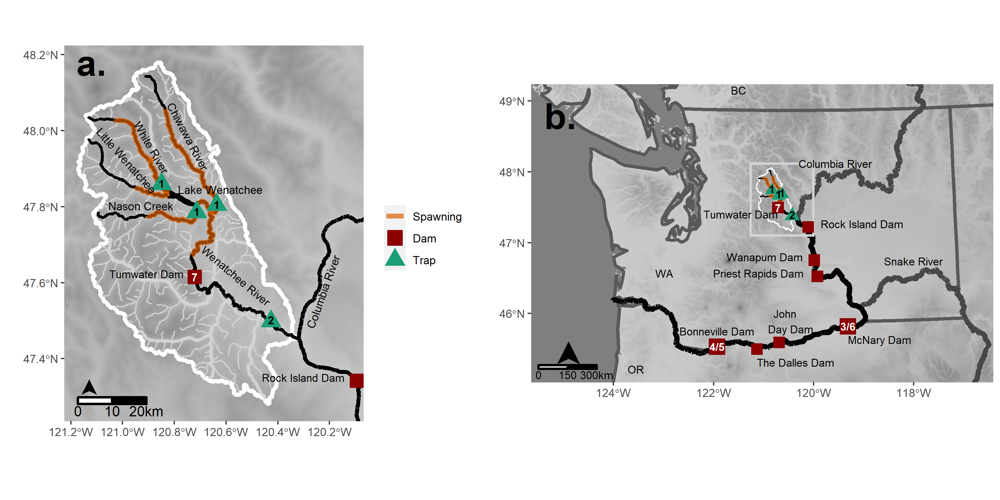

$^1$Washington Cooperative Fish and Wildlife Research Unit, School of Aquatic and Fishery Sciences, University of Washington, Box 355020, Seattle, Washington 98195, USA  
$^2$Washington Department of Fish and Wildlife, 600 Capitol Way, North Olympia, WA 98501 USA.  
$^3$National Marine Fisheries Service, Northwest Fisheries Science Center, 2725 Montlake Boulevard East, Seattle, WA 98112, U.S.A.  
$^4$Yakama Nation Fisheries, Mid-Columbia Field Station, Peshastin, WA 98847, USA  
$^5$US Geological Survey, Washington Cooperative Fish and Wildlife Research Unit, School of Environmental and Forest Sciences & School of Aquatic and Fishery Sciences, University of Washington, Box 355020, Seattle, Washington 98195, USA  

\newpage
## Abstract  {-}

Individual heterogeneity in juvenile life history pathways (LHPs) is often associated with differences in demographic rates in later life stages. Understanding how demographic rates differ among animals expressing different LHPs may enable better prediction of population dynamics and responses to environmental change and reveal fitness tradeoffs that drive the expression of alternative LHPs.  To understand how demographic outcomes and their relationships with environmental variables differ among animals with different LHPs, we analyzed a long-term mark-recapture dataset for Chinook salmon (*Oncorhynchus tshawytscha*) from the Wenatchee River, Washington, USA. Different LHPs in this population either remain in the natal stream until emigrating to the ocean as one-year-olds (*natal-reach rearing*) or emigrate at age zero and rear in downstream habitats for several months before emigrating to the ocean as one-year-olds (*downstream rearing*). We found that downstream-rearing fish emigrated to the ocean 19 days earlier on average and returned as adults from the ocean at higher rates. Rate of return from the ocean by downstream-rearing fish was positively correlated with coastal upwelling in spring, whereas rate of return by natal-reach-rearing fish was positively correlated with summer sea surface temperature. These different responses to environmental variability should lead to asynchrony in adult abundance among juvenile LHPs. A higher proportion of downstream-rearing fish also returned at younger ages than did natal-reach-rearing fish, contributing to variability in age at reproduction and greater mixing across generations. Our results are an example of how individual heterogeneity in juvenile LHP can be associated with demographic differences in subsequent life stages, which may affect variance in the aggregate population abundance and population response to environmental change. This highlights the importance of considering individual heterogeneity in analyses of population demographic rates and lays the foundation for the development of population models that consider individual heterogeneity. 
\newpage
 
## Introduction  {-}

Individual heterogeneity in life history traits (i.e., life history diversity) is often associated with differences in demographic rates throughout the life cycle, which have important consequences for population dynamics [@Vindenes2008Individual; @Forsythe2021Demystifying]. When survival rates of animals exhibiting different life history pathways (LHPs) respond differently to environmental variability, the resulting asynchrony in LHP abundance dampens variability in total population abundance and may confer resilience to environmental change [@elmqvist2003response]. This phenomenon is often referred to as the portfolio effect [@abbott2017portfolio]. Life history diversity also contributes to population stability through variability in age at maturity and longevity, such as when one LHP reaches reproductive maturity at a younger age but another has greater longevity or fecundity [@Lewin2017Juvenile].  

Tradeoffs exist when life history events have both costs and benefits to fitness [@stearns1989trade]. For example, reproduction increases fitness in the short-term, but may reduce survival, and therefore reproduction, in the long-term [@Oosthuizen2021Positive]. Thus, a tradeoff exists between immediate and long-term reproductive output [@McLean2019Lifetime]. Such tradeoffs are believed to play a primary role in the evolution of life histories [@stearns1989trade]. Furthermore, tradeoffs can lead to life history diversity within populations when multiple viable life history tactics exist or when an organism’s state determines which life history tactic will confer the greatest fitness [@Oosthuizen2019Individual; @Lohman2021Individual]. However, individual heterogeneity has often been ignored in studies of population vital rates because of a lack of information and available frameworks to consider it, or a perceived lack of importance [@Gimenez2018Individual; @Armstrong2021Incorporating]. 

A better understanding of how demographic rates differ among animals that express different LHPs could help elucidate the tradeoffs that maintain life history diversity within populations [@Salguero2018Delivering], while a better understanding of diversity in responses to environmental variables could inform how life history diversity contributes to population stability [@Bolnick2011Why; @Hamel2018Quantifying]. Furthermore, information regarding how demographic rates and responses to environmental variability differ among organisms expressing alternative LHPs could benefit conservation and management efforts by informing predictions of how populations will respond to management actions, climate change, and other sources of environmental change that may differentially affect LHPs [e.g., @Lok2019Accounting]. However, the lifetime demographic consequences of alternative LHPs, especially alternative pathways exhibited by young animals, are poorly studied because it is difficult to track individuals throughout their life cycles [@Clutton-Brock2010Individuals]. Above a certain age, it becomes difficult to distinguish individuals that exhibited different juvenile LHPs, yet those pathways may have lifetime effects on demographic rates and fitness [@Metcalfe2001Compensation].


Anadromous salmonids exhibit considerable diversity of LHPs in terms of freshwater habitat use during juvenile life stages, which is associated with increased population stability  [@Bourret2016Diversity;  @Schroeder2015Juvenile]. However, the degree to which lifetime demographic rates and demographic responses to environmental conditions vary among juvenile LHPs within populations is not well understood  [@Bourret2016Diversity; @braun2016population]. To determine how lifetime demographic outcomes differ among animals with different juvenile LHPs, we analyzed a long-term mark-recapture dataset for >150,000 Chinook salmon  (*Oncorhynchus tshawytscha*) with known juvenile LHPs. Fish were marked as juveniles when emigrating from their natal stream, the timing of which defined their juvenile LHP. They were subsequently detected when passing dams during their downstream and upstream migrations, allowing for estimation of survival, return rates from the ocean, and maturation age of fish that had expressed alternative juvenile LHPs. We identified differences in the rates and ages of return from the ocean as well as diversity in responses to environmental variables accross LHPs. These results provide insights into the effects of life history diversity on population dynamics and tradeoffs that may contribute to the maintenance of life history diversity.


## Methods {-}

### Study system {-}

```{r map_cap, echo=FALSE}
library(captioner)
fig_nums <- captioner()
fig_nums("map", "Maps of the Wenatchee River Basin (a) and the Columbia River migration corridor (b). The numbers on dams and traps represent the capture occasions corresponding with fish passing each location.",display=FALSE)

```


```{r table_caption, echo=FALSE, message=FALSE, warning=FALSE, cache=FALSE, include=FALSE}
tab_nums <- captioner(prefix = "Table")

tab_nums("variables", "Variables included in models of: survival probabilities ($\\phi$) following each capture occasion, conditional probabilities of age at return from the ocean given survival($\\psi$), and  detection probabilities ($p$) on each occasion. *LHP* = juvenile life history pathway, *DS* = downstream rearing (only summer and fall subyearling LHPs), *NR.DS* = juvenile life history pathways where summer and fall subyearlings are grouped (i.e., natal-reach vs.downstream rearing), *Ad.age* = adult age, *Stream* = natal stream, *Win.flow* = winter discharge in the Wenatchee River, *Win.air* = winter air temperature in the Wenatchee Basin, *SST.Arc.Win* = sea surface temperature in a broad area in the northeast Pacific ocean defined  by Johnstone and Mantua (2014) in winter, *CUI.Spr* = coastal upwelling off of the coast of Washington State in spring, *SST.WA.Sum* = sea surface temperature off the coast of Washington State in summer,*Flow* = discharge measured at a dam of detection, and *Spill* = percentage of water spilled at dam of detection. . Detection probability at Tumwater Dam for adults was assumed to be 1.0.")

tab_nums("RE", "random effects of year included in models of: $\\phi$ - survival probabilities following each capture occasion, $\\psi$ - probabilities of fish returning from the ocean at different ages , and $p$ - detection probabilities on each occasion. *LHP* = juvenile life history strategy, and *NR.DS* = juvenile life history pathways where summer and fall subyearlings are grouped (i.e., natal-reach vs.downstream rearing). Detection probability at Tumwater Dam for adults was assumed to be 1.0.")
```

```{r surv_caps, echo=FALSE, message=FALSE, warning=FALSE, cache=FALSE, include=FALSE}


fig_nums("time_2_4_surv", "Annual survival estimates between the mouth of the Wenatchee River and McNary Dam (top row) and adult return rates between passing downstream of Bonneville Dam as a juvenile and returning from the ocean to Bonneville Dam as an adult between one and three years later (bottom row). Different juvenile life history pathways are shown in different columns of panels and natal streams are indicated by color. Points represent mean estimates and lines span 95% confidence intervals")


fig_nums("adult_props", "Maximum likelihood estimates of age proportions of returning adult salmon from the ocean by juvenile life history pathway year.")


```

```{r supp_caption, echo=FALSE, message=FALSE, warning=FALSE, cache=FALSE, include=FALSE}

sup_tab_nums <- captioner(prefix = "Table S.")

sup_tab_nums("phi_mean", "Estimates of survival across years by occasion, juvenile life history, natal stream, and fish age. The three juvenile life history pathways are fish that emigrated from their natal stream as subyearlings in summer (*Sum.0*) or fall (*Fal.0*), or as yearlings in spring (*Spr.1*). *DSR* represents both downstream-rearing life histories (summer and fall subyearlings) on occasions when they were assumed to be the same. *LHP* = life history pathway, *Lcl* = lower 95% confidence limit and *ucl* = upper 95% confidence limit." )

sup_tab_nums("psi_mean", "Estimates of proportions of fish returning at ages three through five across years by occasion, juvenile life history, natal stream, and fish age. *DSR* = downstream-rearing life histories (summer and fall subyearling emigrants) and *Spr.1* = natal-reach-rearing life history. *LHP* = life history pathway, *Lcl* = lower 95% confidence limit and *ucl* = upper 95% confidence limit.")


sup_tab_nums("p_mean", "Estimates of detection probabilities across years by occasion, juvenile life history, natal stream, and life history pathway. The three juvenile life history pathways are fish that emigrated from their natal stream as subyearlings in summer (*Sum.0*) or fall (*Fal.0*), or as yearlings in spring (*Spr.1*). *DSR* represents both downstream-rearing life histories (summer and fall). *LHP* = life history pathway, *Lcl* = lower 95% confidence limit and *ucl* = upper 95% confidence limit." )


sup_tab_nums("rand_year_SD_phi", "Standard deviations of Gaussian hyper-distributions of random effects of year on survival by occasion and juvenile life history pathway (LHP).  The three juvenile life history pathways are fish that emigrated from their natal stream as subyearlings in summer (*Sum.0*) or fall (*Fal.0*), or as yearlings in spring (*Spr.1*). *DSR* represents both downstream-rearing life histories (summer and fall). *LHP* = life history pathway, *Lcl* = lower 95% confidence limit and *ucl* = upper 95% confidence limit.")

sup_tab_nums("rand_year_SD_p", "Standard deviations of Gaussian hyper-distributions of random effects of year on detection probabilities by occasion and juvenile life history strategy (LH). The three juvenile life history pathways are fish that emigrated from their natal stream as subyearlings in summer (*Sum.0*) or fall (*Fal.0*), or as yearlings in spring (*Spr.1*).  *DSR* represents both downstream-rearing life histories (summer and fall). *LHP* = life history pathway, *Lcl* = lower 95% confidence limit and *ucl* = upper 95% confidence limit. ")

sup_tab_nums("rand_year_SD_psi", "Marginal standard deviations and correlation of random effects of year on age proportions of returning adults. The proportions were modeled with a multinomial logit link, where age 4 was the reference age. *Lcl* = lower 95% confidence limit and *ucl* = upper 95% confidence limit." )

# sup_tab_nums("looic_tab", "Leave-one-out information criterion values (-115,000 for readability) for models fitted with different strengths of penalties on coefficients (rows) and random effects of year (columns), where larger values indicate stronger penalties. The rows represents different strength of  penalties on coefficients and columns represent different strengths of penalties on random effects of year. Shading of cells reflects their looic value and the lowest value (best combination) is bolded. The column for the strongest penalty on random effects of year is ommited because it had large values that made the color scale less readable." )

# sup_tab_nums("data_tab", "Number of fish released and detected at subsequent occasions by brood year, juvenile life history, and natal stream. The three juvenile life history pathways are fish that emigrated from their natal stream as subyearlings in summer (*Sum.0*) or fall(*Fal.0*), or as yearlings in spring (*Spr.1*).")
# 
# sup_tab_nums("model_params", "Mean paramater estimates, standard errors, and p-values for coefficients in in the models of survival, detection, and adult return age proportions, as well as hypderdistribution standard deviations and correlations for random effects of year. Many of these parameters were subject to penalizing priors, including the standard deviations of the random year effect hyperdistributions. Therefore, the hyperdistribution standard deviations must be interpreted with caution." )


#````````````````````````````````

sup_fig_nums <- captioner(prefix = "Figure S.")

sup_fig_nums("GOF_cond", "DHARMa residual diagnostics for simulated quantile residuals conditional on fitted random effects. The left panel shows a Q-Q plot and the right show a plot of residuals versus rank-transformed model predictions. Red asterisks indicate outliers and the thick lines show a quantile regression fit to the residuals, which should follow the dashed horizontal lines if the residuals are uniformly distributed along the y-axis as expected.")

# sup_fig_nums("GOF_cond_disp", "DHARMa nonparametric dispersion test with simulated quanitle residuals conditional on the fitted random effect values. The plot indicates underdispersion of residuals relative to the expectation.")

# sup_fig_nums("GOF_cond_boot", "DHARMa bootstraped outlier test of whether the number of observations outside the simulation envelop is greter or less than expected for the conditional simulated quanitle residuals. The observed number of outliers is within the confidence interval, suggesting that there are not more or fewer outliers than expected.")


sup_fig_nums("GOF_uncond", "DHARMa residual diagnostics for standardized quantile residuals marginalized over random effects of year. The left panel shows a Q-Q plot and the right show a plot of residuals versus rank-transformed model predictions. Red asterisks indicate outliers and the thick lines show a quantile regression fit to the residuals, which should follow the dashed horizontal lines  if the residuals are uniformly distributed along the y-axis as expected.")


sup_fig_nums("time_1_surv", "Annual survival estimates between release near the mouths of three natal streams -- Chiwawa River, Nason Creek, and White River -- and passing the mouth of the Wenatchee River en route to the ocean, for fish expressing three different juvenile life history pathways. The three juvenile life history pathways are fish that emigrated from their natal stream as subyearlings in summer (*Sum.0*) or fall (*Fal.0*), or as yearlings in spring (*Spr.1*). Points represent mean estimates and lines span 95% confidence intervals.")

sup_fig_nums("Env_cov", "Effects of environmental covariates on survival by occasion (column) and juvenile life history pathway (color). The three juvenile life history pathways are fish that emigrated from their natal stream as subyearlings in summer (*Sum.0*) or fall(*Fal.0*), or as yearlings in spring (*Spr.1*). *DSR* represents both downstream-rearing life histories (summer and fall subyearlings).  *CUI.spr* = coastal upwelling index during spring, *SST.sum* = sea surface temperature off the Washington coast during summer, and *SST.win* = sea surface temperature in an arc of the northeast Pacific Ocean defined by Johnstone and Mantua (2014) during the winter prior to when juveniles enter the marine environment. Points represent mean estimates and lines span 95% confidence intervals.")

sup_fig_nums("timing", "Day of year of detections at three sites (columns) by juvenile life history pathways (rows). Fish from all study years and natal streams are represented. Vertical lines indicate median detection days. Summer (*Sum.0*) and fall (*Fal.0*) subyearling emigrants (downstream-rearing fish) had very similar detection timing to each other. downstream-rearing fish were detected 19 days earlier than yearling (*Spr.1*) emigrants (natal-reach-rearing fish) in the Lower Wenatchee River trap,9 days earlier at McNary Dam, and 10 days earlier at Bonneville Dam on average.")


# sup_fig_nums("Redd_cov", "Coefficients ($\\beta$) for the effects of redd density within natal streams on survival by occasion (column), juvenile life history strategy (color), and natal stream (x-axis). The three juvenile life history pathways are fish that emigrated from their natal stream as subyearlings in summer (*Sum.0*) or fall (*Fal.0*), or as yearlings in spring (*Spr.1*). *DSR* represents both downstream-rearing life histories (summer and fall). Points represent mean estimates and lines span 95% confidence intervals.")

sup_fig_nums("time_3_surv", "Annual survival estimates between McNary Dam and Bonneville Dam  by natal stream (color) and juvenile life history pathway (column): Points represent mean estimates and lines span 95% confidence intervals.")


sup_fig_nums("time_5_6_surv", "Annual survival estimates for upstream migrating adult Chinook salmon between Bonneville Dam and McNary Dam (top row) and McNary Dam and Tumwater Dam (bottom row), where color represents adult age. Points represent mean estimates and lines span 95% confidence intervals.")

sup_fig_nums("time_2_det", "Annual recapture probability estimates for downstream-migrating juvenile Chinook salmon at the lower Wenatchee River screw trap by natal stream (colors) and juvenile life history strategy (columns). The three juvenile life history pathways are fish that emigrated from their natal stream as subyearlings in summer (*Sum.0*) or fall (*Fal.0*), or as yearlings in spring (*Spr.1*). Points represent mean estimates and lines span 95% confidence intervals.")


sup_fig_nums("time_3_4_det", "Annual detection probability estimates for downstream-migrating juvenile Chinook salmon at McNary Dam (top row) and  Bonneville Dam (bottom row) by natal stream (colors) and juvenile life history pathway: *DSR* = downstream-rearing life histories (summer and fall subyearling emigrants) and *Spr.1* = natal-reach-rearing life history (spring yearling emigrants). Points represent mean estimates and lines span 95% confidence intervals.")

sup_fig_nums("time_5_6_det", "Annual detection probability estimates for upstream-migrating adult Chinook Salmon at Bonneville Dam (top row) and  McNary Dam (bottom row), where color represents adult age. Points represent mean estimates and lines span 95% confidence intervals.")


# sup_fig_nums("GOF_uncond_disp", "DHARMa nonparametric dispersion test with simulated quantile residuals *un*conditional on the fitted random effect values.")
# 
# sup_fig_nums("GOF_uncond_boot", "DHARMa bootstraped outlier test of whether the number of observations outside the simulation envelop is greter or less than expected for the *un*conditional simulated quanitle residuals. The observed number of outliers is within the confidence interval, suggesting that there are not more or fewer outliers than expected.")


```

The Wenatchee River Basin lies in central Washington State, USA (`r fig_nums("map",display="cite")`b) and supports a population of federally endangered spring Chinook salmon. As is common among Chinook salmon, juveniles exhibit a two-stage emigration from natal streams [@Copeland2009Contribution; @Bourret2016Diversity; @Schroeder2015Juvenile]; stage-one emigration is to downstream freshwater rearing areas and occurs within the first or second year of life, while stage-two emigration is to the ocean and occurs in the second spring of life [@Buchanan2015Estimating; @favrot2020fall]. One LHP is characterized by fish remaining in the natal stream until their second spring of life and initiating stage-two emigration directly after stage one (*natal-reach rearing*). Other LHPs are characterized by fish carrying out stage-one emigration from natal streams in spring, summer, or fall of their first year of life, and rearing and overwintering in downstream reaches prior to initiating stage-two emigration the following spring (*downstream rearing*). Adults return from the ocean in spring at age three, four, or five, reside within the Wenatchee River Basin over summer, and spawn in late summer.


### Data {-}

From 2006 through 2017, juvenile spring Chinook salmon were sampled with rotary screw traps upon emigration from three natal streams (stage-one emigration) – the Chiwawa River, Nason Creek, and the White River (`r fig_nums("map",display="cite")`a). The traps were installed in early spring and operated continuously through late fall. Captured juveniles > 60 mm were implanted with passive integrated transponder (PIT) tags within their peritoneal cavity using a syringe. PIT tags transmitted a unique radio-frequency identification (RFID) code when triggered by an electromagnetic pulse from an RFID reader such that encounter histories unique to each tagged individual could be constructed. The dates and locations that marked fish were released and subsequently detected were downloaded from the Columbia Basin PIT Tag Information System (www.ptagis.org).  

We categorized fish  in our dataset into three juvenile LHPs based on their age at emigration (corresponding to their age at first capture). LHPs were delineated based on the seasonality in average daily emigrant abundances (*Sorel et al., In Prep*): (1) summer subyearlings; (2) fall subyearlings; and (3) spring yearlings. Summer subyearlings were the youngest fish that were large enough to be marked with PIT tags. They emigrated as subyearlings between day of year (DOY) 141 and 262. Fall subyearlings emigrated as subyearlings between DOY 263 and when the traps were removed in early winter ($\leq$ DOY 345). Spring yearlings emigrated as yearlings in spring, between when traps were installed in spring ($\geq$ DOY 53) and DOY 179, and were distinguished from subyearlings based on a previously developed length-date cutoff rule (*Sorel et al., In Prep*).


Following initial capture, the first opportunity for detection (constituting the second capture occasion) occurred at a rotary screw trap operated near the confluence of the Wenatchee River and the Columbia River  (*lower Wenatchee screw trap*) (`r fig_nums("map",display="cite")`a). This trap was only operated from late winter through summer, but we assumed that downstream-rearing fish remained within the Wenatchee River Basin until their second spring of life, at which point surviving individuals could be recaptured when passing the lower Wenatchee screw trap during stage-two emigration. It is possible that some fish passed the lower Wenatchee screw trap as subyearlings in late fall when the trap was not operated, which could introduce bias into survival estimates if these fish had different survival rates than fish that remained within the Wenatchee River Basin. Spring yearling emigrants were captured as they left their natal stream in their second spring of life. These fish immediately migrated past the lower Wenatchee screw trap, en route to the ocean.

Subsequent capture occasions occurred as fish transited downstream on their way to the ocean and when they traveled back upstream as adults prior to spawning. The third and fourth capture occasions occurred at juvenile bypass systems at the McNary and Bonneville Dams within the Columbia River seaward migration corridor (`r fig_nums("map",display="cite")`). Only juveniles that passed dams via the juvenile fish bypass systems were detected as there were no RFID readers in other passageways (i.e., spillways or turbines). After passing Bonneville Dam as juveniles, fish entered the marine environment and could not be detected until they returned to Bonneville Dam as adults one to three years later. 

The fifth and sixth capture occasions occurred as returning adult fish transited fish ladders at Bonneville and McNary Dams, which are the only passage routes upstream through these dams. The seventh and final capture occasion occurred at the fish ladder at Tumwater Dam on the mainstem of the Wenatchee River, which all fish must transit to return to their natal streams. 

We used data on several environmental variables as covariates in our analysis. Wenatchee River discharge was recorded at USGS gauge 12459000 and obtained using the dataRetrieval package in R version 4.0.4  [@R2021R; @Cicco2018dataRetrieval]. Air temperature was recorded at Wenatchee Pangborn Airport and obtained from the National Weather Service using the NOWData webtool (https://w2.weather.gov/climate/xmacis.php?wfo=otx).  Data on discharge, and spill percentage at mainstem Columbia River Dams were obtained using the Columbia Basin Research Data Access in Real Time webtool (http://www.cbr.washington.edu/dart/query/river_graph_text). Data on seasonal sea surface temperature and coastal upwelling anomalies were obtained from the github repository (bchasco/SAR_paper) associated with Chasco et al. [-@Chasco2021Differential].


```{r, cache=FALSE, echo=FALSE, warning=FALSE, message=FALSE}
options(tinytex.verbose = TRUE)
knitr::opts_chunk$set(echo=FALSE)
library(here)
library(tidyverse)
library(TMB)
library(TMBhelper)
library(glmmTMB)
library(DHARMa)
library(viridis)


```


```{r, eval=TRUE, echo=FALSE, message=FALSE, warning=FALSE, cache=FALSE, paged.print=TRUE}
source(here("src","mscjs_wen_helper_funcs.R"))
source(here("src","Wen_MSCJS_re_3.R"))
# mark_file_CH$rel_DOY_2<-mark_file_CH$`Release Day Number`+ifelse(mark_file_CH$LH=="smolt",365,0)
# hist(mark_file_CH$rel_DOY_2,breaks=seq(0,600,10))
# hist(mark_file_CH$`Length mm`,breaks=seq(0,max(mark_file_CH$`Length mm`,na.rm=TRUE)+5,2.5))
# cor(mark_file_CH$`Length mm`,mark_file_CH$rel_DOY_2,use="complete.obs")
site_year_det<-mark_file_CH %>% filter(LH!="Unk") %>%  select(sea_Year_p,LH,stream,LWe_J:Tum_A) %>%  group_by(sea_Year_p,LH,stream) %>%
  summarise(n(),across(LWe_J:Tum_A,function(x)sum((x>0))),.groups = "keep") %>% 
  rename(Release=`n()`) #%>% print(n=100)
#not using TDD_A or JDD_A currently because of missing years and relatively good detection upstream.
```  


### Model description {-}

We used a multi-state mark-recapture model to estimate downstream survival and ocean return rate ($\phi_{t,l,s,y}$) by interval ($t$), juvenile LHP ($l$), natal stream ($s$), and year ($y$); upstream adult survival ($\phi_{t,y,a}$) by interval, year, and age ($a$); and maturation probabilities ($\psi_{l,y,a}$) by juvenile LHP, year, and age [@Arnason1973estimation; @Brownie1993Capture-Recapture]. Because fish could not be observed after passing downstream of Bonneville Dam unless they returned to Bonneville Dam one to three years later (occasion five), annual marine survival and maturation (i.e., return) probabilities were confounded and not separately identifiable. Instead, we modeled the probability of return, at any age, for all fish entering the ocean each year, and conditional on return, the probabilities of fish spending one, two, or three years at sea [@Buhle2018Using]. 


#### Survival and marine-return rates{-}

Juvenile survival and return rates ($\phi$) were modeled  as:  

\begin{equation}
\begin{split}
logit(\phi_{t,l,s,y})=\alpha_{t} + {\mathbf{x}_{t,l,s,y}} \boldsymbol \beta + \delta_{t,y}+\epsilon_{t,l,y}\\
\delta_{t,y} \sim N(0,\sigma_{t})\\
\epsilon_{t,l,y} \sim N(0,\tau_{t,l})
\end{split}
(\#eq:logitsurv)  
\end{equation}

where $\alpha_{t}$ is an occasion-specific intercept, $\mathbf{x}_{t,l,s,y}$ is a vector of covariates and categorical effects, $\boldsymbol \beta$ is a vector of coefficients, $\delta_{t,y}$ are random effects of year specific to each time interval, and $\epsilon_{t,y,l}$ are random effects of year specific to each time interval and LHP (where certain LHPs were grouped in some intervals). The random effects of year were assumed to be normally distributed around zero with standard deviation $\sigma_{t}$ for effects modeled as synchronous across LHPs, and $\tau_{t,l}$ for effects modeled as specific to individual LHPs. 

To improve parameter identifiability and increase model parsimony, we applied penalized-complexity priors [@Simpson2017Penalising] on coefficients $\mathbf{\beta}$ and random effects of year.  For the penalties, each coefficient ($\beta_n$) was assumed to be drawn from a zero-centered normal distribution, $\beta_n\sim N(0,\upsilon_{\beta_n})$, with a standard deviation ($\upsilon_{\beta_n}$) that was unique to each coefficient in the model. An exponential penalty was applied on each standard deviation, $\upsilon_{\beta_n} \sim exp(\lambda_t)$, where the rate parameter ($\lambda_t$) determined the strength of the penalty and was applied to all $\upsilon_{\beta_n}$ within a given interval.  In addition, to help with model fitting, a unique penalty rate parameter ($\lambda^{\text{rand}}_t$) was fit for random effect standard deviations in each interval and was used for all random effect standard deviations in each interval. We applied a half-normal prior with a standard deviation of _50_ on all penalty rate parameters to constrain those that were not well informed by the data. The covariates and categorical effects included in each survival interval are presented in `r tab_nums("variables",display="cite")` and random-effects structures are presented in `r tab_nums("RE",display="cite")`. We used sum-constraint coding for all categorical variables in the design vectors ($\mathbf{x}_{t,l,s,y}$) so that we penalized deviations from across-group averages.

During the first survival interval (from first capture to passage of the screw trap at the confluence of the Wenatchee and Columbia Rivers), we fit penalized effects of juvenile LHPs, natal streams, and their interactions. In the second through fourth intervals, we grouped the two downstream-rearing LHPs (summer and fall subyearling emigrants; *downstream rearing*), to increase statistical power considering the relatively small sample size of summer subyearling emigrants. This decision was also supported by our observation that the two downstream-rearing LHPs had similar detection timing on occasions two through four (`r fig_nums("timing",display="cite")`). In contrast, natal-reach-rearing emigrants had different detection timing on these occasions. Therefore, during the second through fourth survival intervals, we modeled penalized effects of downstream vs. natal-reach reach rearing, natal stream, and their interactions. 


During the first interval, we included effects of average annual winter (November–February) air temperature and Wenatchee River discharge on survival of summer sub-yearling and fall subyearling LHPs [@favrot2020fall], allowing for separate effects by LHP but assuming common effects across natal streams. Based on relationships between Chinook salmon return rates from the ocean and environmental covariates reported by Crozier et al. [-@Crozier2021Climate], we evaluated the effects of three covariates on return rates (fourth interval): sea surface temperature in an arc of the northeast Pacific Ocean defined by Johnstone and Mantua  [-@Johnstone2014Atmospheric] during the winter prior to the spring when fish entered the marine environment, coastal upwelling anomalies off of the coast of Washington State in the spring when fish entered the ocean, and sea surface temperature off of the coast of Washington State during the summer after fish entered. Coefficients of all environmental covariates on survival during intervals two through four were allowed to vary between natal-reach and downstream-rearing LHPs but were assumed to be common across natal streams to increase statistical power to detect relationships. All environmental covariate values were *Z*-scored prior to inclusion in the analysis.


In the fifth and sixth survival intervals, representing adult upstream migration, we did not model effects of juvenile LHPs nor natal streams on survival, assuming that carryover effects from the juvenile life stage would be diminished by adulthood and due to the smaller numbers of detections of returning adults (`r tab_nums("variables",display="cite")`). Instead, we modeled effects of adult return age (*a*) on survival, as might result from  age-specific migration timing differences and seasonality in fisheries or physical conditions in the river. Adult survival was modeled as:

\begin{equation}
\begin{split}
logit(\phi_{t,y,a})=\alpha_t+\mathbf{x}_{t,y,a}\mathbf{\beta}+\delta_{t,y}\\
\delta_{t,y} \sim N(0,\sigma_t)
\end{split}
(\#eq:adultsurv)  
\end{equation}

No asynchronous year effects were included for upstream adult survival, due to the lower statistical power given the smaller number of adult detections. 

#### Return ages {-} 

The conditional probabilities ($\boldsymbol \psi_{l,y}$) of returning at ages three, four, or five given that a fish returned from the ocean were modeled using a multinomial logit link,  

\begin{equation}
\begin{split}
mlogit(\boldsymbol \psi_{l,y}) &= \boldsymbol \alpha^\psi +  {\mathbf{x}^{\psi}_{l,y}} \boldsymbol \beta ^\psi +  \boldsymbol \delta^\psi_y\\
\boldsymbol \delta^\psi_y &\sim N(0, \boldsymbol \Sigma^\psi)\\
\end{split}
(\#eq:psipriors)  
\end{equation}


where $\mathbf{\alpha}^\psi$ represents intercepts for ages three and five in multinomial logit space (age four is the reference with intercept of 0.0) and $\mathbf{\beta}^\psi$ is a vector of coefficients for differences between natal-reach and downstream-rearing fish. These differences were penalized in the same fashion as coefficients in the model of survival, with penalty rate parameter $\lambda^\psi$. We modeled only random effects of year that were synchronous across LHPs ($\mathbf{\delta}_y^\psi$) for adult return age probabilities due to limited power to fit asynchronous random effects of year. The synchronous random effects of year for each return age were bivariate normally distributed with covariance matrix $\mathbf{\Sigma}^{\psi}$ to account for the inherent correlation in the proportions of the population that returned at different ages each year [@Buhle2018Using]. The marginal standard deviations of the random effects of year were penalized as described above for the random effect standard deviations in the survival model, with penalty rate parameter $\lambda^{\psi^{\text{rand}}}$.

#### Detection {-}

Detection probabilities were modeled in logit space using the same specification of categorical effects `r tab_nums("variables",display="cite")` and random effects of year `r tab_nums("RE",display="cite")` as for survival. However, different covariates were used. Coefficients and random effects of year were penalized in the same way as for survival, with unique penalty rate parameters $\lambda^p_t$ and $\lambda^{p^{\text{rand}}}_t$ for each occasion.

On the third and fourth recapture occasions (juvenile detection at McNary and Bonneville Dams), we included effects of average daily discharge and spill percentage in May–June at McNary and Bonneville Dams, as these could affect the proportion of fish going through the juvenile bypass systems as opposed to spillways or turbines. Just as for survival probabilities, we allowed for different effects of environmental covariates – flow and spill – on detection probabilities of natal-reach and downstream-rearing LHPs, because of their different migration timing, but assumed common effects across natal streams.

Detection probability on the final occasion (Tumwater Dam) was fixed at 1.0 to ensure identifiability of the interval-specific survival rate and based on the auxiliary observation that  `r (top<-sum(mark_file_CH$instr_array!=0&mark_file_CH$Tum_A!=0,na.rm=TRUE))` out of `r (bottom<-sum(mark_file_CH$instr_array!=0,na.rm=TRUE))` fish (`r round((top/bottom)*100,2)`%) detected in adult fish ladders in main-stem Columbia River Dams and subsequently detected on in-stream arrays upstream of Tumwater Dam were also detected at Tumwater Dam.


### Model fitting {-}

The likelihood of the data for a given set of parameters was calculated using the forward algorithm [@McClintock2020Uncovering; @Zucchini2016Hidden], and the Laplace approximation of the marginal log-likelihood integrated over random effects was calculated by the package TMB in R [@Kristensen2016TMB; @R2021R]. We fit the model by minimizing the negative marginal log-likelihood, which was conducted in R using the TMBhelper::fit_tmb function, which relies on the base::nlminb optimization algorithm [@Gay1990Usage; @Thorson2020TMBhelper]. Fixed effects were intercepts, standard deviations, covariance, and penalty-rate parameters. The random effects were the coefficients and all random effects of year. To calculate confidence intervals for derived quantities, we conducted a parametric bootstrap where we sampled 10,000 fixed and random effects from a multivariate normal distribution defined by the maximum marginal likelihood estimates and the inverse Hessian matrix, then calculated derived quantities with each sample parameter set and found the quantiles corresponding with the confidence interval.  

### Goodness of fit {-}

We assessed goodness of fit by examining scaled quantile residuals [@Dunn1996Randomized; @Gelman2006Data]. We simulated 250 datasets of the same size as the observed data by sampling from binomial distributions for survival and detection, and multinomial distributions for return age, conditional on the marginal maximum likelihood estimates (MLEs) of parameters. Conditional simulations were conducted using the MLEs of model parameters and random effects of year, while marginal simulations were conducted using the MLEs of model parameters (including coefficients) but sampling random effects of year from their hyper-distributions. We summarized simulated and observed datasets by the numbers of recaptures on each occasion from each release group (LHP by stream by year) and adult age for adult detection occasions. We used the DHARMa package [@Hartig2021DHARMa] to calculate scaled quantile residuals for the summarized numbers of recaptures and to interrogate the residuals for outliers and departures from uniformity. 

In addition, we calculated *P* values  by sampling 500 parameter sets from the multivariate normal distribution defined by the MLEs and inverted Hessian matrix and calculating the Freeman-Tukey fit statistic,  $\sum_t{\sum_l{\sum_s{\sum_y{\sum_a{(\sqrt{d_{t,l,s,y,a}}-\sqrt{E[d_{t,l,s,y,a}]})^2}}}}}$
for observed and simulated data generated with each parameter set [@conn2018guide]. Here, $d_{t,l,s,y,a}$ is the summarized number of detections at a given occasion for fish of a given juvenile LHP, natal stream, year, and age, and $E[d_{t,l,s,y,a}]$ is the expectation of that number of detections given the model and a particular parameter set. The *P* value was then calculated as the proportion of parameter sets in which the Freeman-Tukey fit statistic for the simulated data was greater than the statistic for the observed data. We calculated *P* values either conditionally given the fitted random effects of year or marginally by sampling random effects of year from their hyper-distributions.


```{r , message=FALSE, warning=FALSE, process_dat,echo=FALSE,cache=FALSE}
mscjs_dat<- make_dat(mark_file_CH,sites=c( "LWe_J",
  "McN_J",
  #"JDD_J",
   "Bon_J",
   #"Est_J",
  "Bon_A","McN_A",
  #"PRa_A","RIs_A",
  "Tum_A"),cont_cov=c(),length_bin = 5,doy_bin = 10,inc_unk = FALSE,exc_unk=TRUE) #,"mark_DOY_bin","length_bin"


# rm(mark_file_CH)
rm(all_bio_data)
# gc()
```


```{r full_model, message=FALSE, warning=FALSE,echo=FALSE,eval=FALSE,cache=FALSE}

mscjs_fit<-fit_wen_mscjs(x=mscjs_dat,
                         #*survival*
                         phi_formula=par.index~

                           ## to Lower Wenatchee
                           -1+
                           time1+

                           time1:LH +
                           time2:age_class+
                           time3:age_class+
                           time4:age_class +
                           # -LH*time1 +
                           time1:stream+
                           time1:LH:stream+
                           # time1:LHsummer:length_bin_scaled+
                           # time1:streamWhite+
                           # time1:streamNason+
                           # time1:streamWhite:LH+
                           # time1:streamNason:LH+
                           #
                           # time1:LH:stream:redd_stan+

                           time1:win_air:LHfall+
                           time1:win_air:LHsummer +
                           time1:win_flow:LHfall+
                           time1:win_flow:LHsummer+

                           # diag(0+|mig_year) +
                           diag(0+time1+time1:LH|mig_year)+

                           ## to McNary
                           time2+

                           time2:stream+
                           time2:age_class:stream+

                           # time2:age_class:stream:redd_stan+

                           # time2:RIS_flow_juv:age_class+
                           # time2:RIS_temp_juv:age_class+
                           # time2:UC_spill_pct_juv:age_class +

                           # diag(0+time2 |mig_year)+
                           diag(0+time2 +time2:age_class|mig_year)+

                           ##to Bonneville
                           time3 +

                           time3:stream+
                           time3:age_class:stream+

                           # time3:age_class:stream:redd_stan+

                           # time3:McN_flow:age_class+
                           # time3:McN_temp:age_class+
                           # time3:MC_spill_pct_juv:age_class+

                           # diag(0+time3|mig_year)+
                           diag(0+time3+time3:age_class|mig_year)+

                           ## SAR to Bonneville adult
                           time4 +

                           time4:stream+
                           time4:age_class:stream+
                           # time4:age_class:stream:redd_stan+

                           time4:ersstWAcoast.sum:age_class +
                           time4:ersstArc.win:age_class+
                           time4:cui.spr:age_class +

                           # diag(0 |mig_year)+
                           diag(0+time4+time4:age_class|mig_year)+


                           ## to McNary Adult
                           time5 +
                           time5:stratum +
                           diag(0+time5|mig_year)+

                           ## to Tumwater Adults
                           time6 +
                           time6:stratum+
                           diag(0+time6|mig_year)
                         ,

                         #*detection*
                         p_formula= par.index~

                           ## Lower Wenatchee Trap
                           -1+
                           time2+
                           time2:LH+
                           time3:age_class+
                           time4:age_class+

                           time2:stream +
                           time2:LH:stream+

                           # diag(0+time2|mig_year)+
                           diag(0+time2+time2:LH|mig_year) +
                           # time2:LH:stream:redd_stan+
                           # time2:LHfall:redd_stan +
                           #time2:LWe_new+

                           ## McNary Juveniles
                           time3 +

                           time3:stream +
                           time3:age_class:stream+

                           time3:McN_flow:age_class +
                           time3:McN_spill:age_class +

                           # diag(0+time3|mig_year) +
                           diag(0+time3+time3:age_class|mig_year) +

                           # Bonneville Juvenile
                           time4 +

                           time4:stream +
                           time4:age_class:stream+

                           time4:Bon_flow:age_class+
                           time4:Bon_spill:age_class+
                           # time4:LH:redd_stan+
                           # time4:McN_J+
                           # diag(0|mig_year)+
                           diag(0+time4+time4:age_class|mig_year) +


                           # Bonn adult
                           time5 +
                           time5:stratum +
                           diag(0+time5 |mig_year)+

                           #McNary adult
                           time6+
                           time6:stratum+
                           diag(0+time6 |mig_year)
                         ,
                         #maturation age
                         psi_formula= par.index~
                           -1+
                           tostratum +
                           tostratum:age_class+
                           # tostratum:streamChiwawa +
                           # tostratum:streamWhite+
                           us(0+tostratum|mig_year)#+diag(0+tostratum:LH|mig_year)
                         ,

                         doFit = TRUE,silent=FALSE,
                         sim_rand =0,REML=FALSE,pen=log(rep(5,5)), hypersd=1,map_hypers=c(FALSE,FALSE))


design_view<-mscjs_dat$Phi.design.dat %>% select(LH,stream,time) %>% cbind(mscjs_fit$dat_TMB$X_phi %>% as_tibble %>% select(-c("time1:win_air:LHfall":"time1:LHsummer:win_flow" ,"time4:age_classsmolt:ersstWAcoast.sum":last_col()))) %>% distinct() %>% as_tibble()

design_view %>% filter(time==2)%>% select(c(1:5,starts_with("time2"))) %>% View


par_out<-mscjs_fit$mod$env$parList(par=mscjs_fit$last_par_best)
par_out$pen_phi %>% exp
par_out$pen_p %>% exp
par_out$pen_psi %>% exp
par_out$pen_rand_phi %>% exp
par_out$pen_rand_p %>% exp
par_out$pen_rand_psi %>% exp


# mscjs_fit$dat_TMB$X_phi %>% colnames()
```

```{r full_model_load, message=FALSE, warning=FALSE,echo=FALSE,eval=TRUE,cache=FALSE, include = FALSE}
load(here("results","mscjs_fit.rdata"))
setwd(here("Src"))
TMB::compile("wen_mscjs_re_4.cpp")
dyn.load(dynlib("wen_mscjs_re_4"))
mscjs_fit$mod$retape()

setwd(here())
```

```{r organize_output, eval=TRUE, echo=FALSE, message=FALSE, warning=FALSE, cache=TRUE,cache.extra = file.mtime(here("results","mscjs_fit.rdata"))}


sd_rep<-mscjs_fit$fit$SD
mod_rep<-mscjs_fit$mod$report(mscjs_fit$last_par_best)

Phi.design.dat2 <- mscjs_dat$Phi.design.dat%>% select(sea_Year_p:mig_year,age_class) %>% mutate(
                                            eta_phi= sd_rep$value[names(sd_rep$value)=="eta_phi"],
                                            eta_phi_sd=sd_rep$sd[names(sd_rep$value)=="eta_phi"],
                                            phi_fit=plogis(eta_phi),
                                            lcl_phi=plogis(qnorm(.025,eta_phi,eta_phi_sd)),
                                            ucl_phi=plogis(qnorm(.975,eta_phi,eta_phi_sd))) %>% 
  mutate(  LH=case_when(LH=="summer"~"Sum.0",
               LH=="fall"~"Fal.0",
               LH=="smolt"~"Spr.1"),
                                                                                     LH=fct_relevel(LH,"Sum.0","Fal.0","Spr.1"), 
          stratum=as.character(as.numeric(stratum)+2)) %>% 
  mutate(age_class=ifelse(age_class=="smolt","Spr.1","DSR"))%>% 
  # group_by(LH,mig_year,stream,time) %>%
  # mutate(cohort_freq=sum(freq)) %>% 
  # mutate(across(phi_fit:ucl_phi,~sum(.*freq/cohort_freq))) %>% 
  filter(!(time=="1"&LH=="Unk"))#%>% 
  # summarize(sum(length_bin*freq/cohort_freq))


#calculate mean and sd of survival by occasion, life history, and stream
phi_mean<-Phi.design.dat2 %>% filter(!(time!=1 & LH=="Sum.0"),!(as.numeric(as.character(time))>=5&(LH!="Spr.1"|stream!="Chiwawa")))  %>%  group_by(time,LH,age_class,stream,stratum) %>%  summarize(mean_phi=round(mean(phi_fit),3),sd_phi=round(sd(phi_fit),3))  %>%  ungroup()  %>% 
  mutate( time=as.numeric(as.character(time)), 
          LH=as.character(LH), 
          LH=case_when(time==1~LH, 
                       time>=5~"all",
                       TRUE~age_class), 
          stream=ifelse(time>=5,"all",stream)) %>% 
  select(-age_class) %>% 
  rename("fish.age"="stratum") %>% 
  mutate(fish.age=as.numeric(as.character(fish.age)),  
         fish.age=ifelse(time>=5,fish.age,fish.age-1))


p.design.dat <- mscjs_dat$p.design.dat %>% mutate(#p_fit=mod_rep$p[-length(mod_rep$p)],
                                            eta_p=sd_rep$value[names(sd_rep$value)=="eta_p"],
                                            eta_p_sd=sd_rep$sd[names(sd_rep$value)=="eta_p"],
                                             p_fit=plogis(eta_p),
                                            lcl_p=plogis(qnorm(.025,eta_p,eta_p_sd)),
                                            ucl_p=plogis(qnorm(.975,eta_p,eta_p_sd)))%>% 
  filter(!(time=="1"&LH=="Unk"))%>% 
  mutate(  LH=case_when(LH=="summer"~"Sum.0",
               LH=="fall"~"Fal.0",
               LH=="smolt"~"Spr.1"),
                                                                                     LH=fct_relevel(LH,"Sum.0","Fal.0","Spr.1"), 
          stratum=as.character(as.numeric(stratum)+2)) %>% 
  mutate(age_class=ifelse(age_class=="smolt","Spr.1","DSR"))

##calculate mean and sd of detection by occasion, life history, and stream
p_mean<-p.design.dat %>% filter(!(time!=2 & LH=="Sum.0"), !(as.numeric(as.character(time))>=5&(LH!="Spr.1"|stream!="Chiwawa")))  %>%  group_by(time,LH,age_class,stream,stratum) %>%  summarize(mean_p=round(mean(p_fit),3),sd_p=round(sd(p_fit),3))  %>%  ungroup()  %>% 
  mutate( time=as.numeric(as.character(time)), 
          LH=as.character(LH), 
          LH=case_when(time==2~LH, 
                       time>=5~"all",
                       TRUE~age_class),
          stream=ifelse(time>=5, "all", stream)) %>% 
  select(-age_class) %>% 
  rename("fish.age"="stratum") %>% 
  mutate(fish.age=as.numeric(as.character(fish.age)),  
         fish.age=ifelse(time>=5,fish.age,fish.age-1)) 
                                


Psi.design.dat<-mscjs_dat$Psi.design.dat %>% filter(tostratum==2) %>% select(LH,mig_year,age_class) %>% cbind(mod_rep$psi) %>% #filter(LH!="summer",McN_J==0,stream!="LWE") %>%
  pivot_longer(`1`:`3`,names_to="years",values_to="prop") %>% distinct() %>%  
  mutate(
  LH=case_when(LH=="summer"~"Sum.0",
               LH=="fall"~"Fal.0",
               LH=="smolt"~"Spr.1"),
                                                                                     LH=fct_relevel(LH,"Sum.0","Fal.0","Spr.1"), 
  years=as.character(as.numeric(years)+2)) %>% 
  mutate(age_class=ifelse(age_class=="yrlng","Spr.1","DSR"))

#calculate mean and sd of return age probs. by occasion, life history, and stream
psi_mean<-Psi.design.dat %>%  group_by(age_class,years) %>%  summarize(mean_psi=round(mean(prop),3),sd_psi=round(sd(prop),3))  %>% ungroup()


#table of paramater values
invisible(capture.output(param_tab<-print_out(mscjs_fit))) 
#%>% mutate(LH=ifelse(LH=="fall","Subyearling","Smolt")) 


# look at lower wenatchee to tumwater survival by life history

# Phi.design.dat2$Time %>% range()
# 
# ave_surv<-Phi.design.dat2 %>% filter(Time>=1&Time<=3&LH!="Sum.0") %>% group_by(age_class,sea_Year_p,stream ) %>% summarise(xx=prod(plogis(eta_phi))) %>% ungroup() %>% group_by(age_class) %>% summarize(mean(`xx`))
# 
# 
# ave_psi<-psi_mean %>% filter(years!=3) %>% group_by(age_class) %>% summarize(sum(mean_psi))
# 
# ave_psi$`sum(mean_psi)`*ave_surv$`mean(xx)`


#----------------------------------------------------------
# bootstrap derived quanitity CIs

sim_posterior<-rmvnorm_prec(mu=mscjs_fit$last_par_best,
                            prec=mscjs_fit$fit$SD$jointPrecision, 10000, random_seed=1 )

full_post<-sim_posterior

fun<-function(x){
  thing1<-x[which(names(mscjs_fit$last_par_best)%in%c("beta_psi_ints","beta_psi_pen"))]
  # thing2<-x[which(names(mscjs_fit$last_par_best)=="beta_psi_pen")]
  
  b1<-thing1[1:2]+thing1[3:4]
  b2<-thing1[1:2]-thing1[3:4]
  
  ret1<-exp(c(b1[1],0,b1[2]))/(1+sum(exp(b1)))
  ret2<-exp(c(b2[1],0,b2[2]))/(1+sum(exp(b2)))
  return(c(ret1,ret2))
}

# median return age proportions by juvenile emigration age
wow<-apply(sim_posterior,2,fun)


psi_tab<-cbind(psi_mean[,1:2],mean=apply(wow,1,mean) %>% round(3),median=round(fun(mscjs_fit$last_par_best),3),apply(wow,1,quantile,probs=c(.025,.975)) %>% t() %>% round(3))

est_ci<-function(x){
  paste0(sprintf("%.3f",x[1]) ,"; ",sprintf("%.3f",x[2]) ," -- ",sprintf("%.3f",x[3]))
}


  ##-----------------------------------------
#phi
##make all environmental covariate value 0 to get median
discr_design_phi<- mscjs_fit$dat_TMB$X_phi %>% as_tibble() %>%  mutate(across(c("time4:age_classsmolt:ersstWAcoast.sum":last_col()),function(x)x=0))
   
# "time2:age_classsmolt:RIS_flow_juv":"time2:age_classsub:UC_spill_pct_juv","time3:age_classsmolt:McN_flow":"time3:age_classsub:MC_spill_pct_juv","time4:age_classsub:streamWhite:redd_stan"

#indices of posterior samples for phi params
ind<-which(names(mscjs_fit$last_par_best)%in%c("beta_phi_ints","beta_phi_pen"))

#medians for LHPs in interval 2
sim_posterior_t2<-sim_posterior[ind[which(colnames(mscjs_fit$dat_TMB$X_phi)%in%c("time2" ,"time2:age_class1" ))],]


med2<-matrix(NA,2,3)
med2[1,2:3]<-(sim_posterior_t2[1,]+sim_posterior_t2[2,]) %>% plogis %>% quantile(probs=c(.025,.975)) %>% round(3)
med2[1,1]<-(mscjs_fit$last_par_best[ind[which(colnames(mscjs_fit$dat_TMB$X_phi)=="time2")]]+mscjs_fit$last_par_best[ind[which(colnames(mscjs_fit$dat_TMB$X_phi)=="time2:age_class1")]]) %>% plogis() %>% round(3)
med2[2,2:3]<-(sim_posterior_t2[1,]-sim_posterior_t2[2,]) %>% plogis %>% quantile(probs=c(.025,.975))%>% round(3)
med2[2,1]<-(mscjs_fit$last_par_best[ind[which(colnames(mscjs_fit$dat_TMB$X_phi)=="time2")]]-mscjs_fit$last_par_best[ind[which(colnames(mscjs_fit$dat_TMB$X_phi)=="time2:age_class1")]]) %>% plogis() %>% round(3)


med2_yrlngs<-med2[1,] %>% est_ci()
med2_subs<-med2[2,] %>% est_ci()

#stream specific time 2 medians
sim_posterior_phi<-sim_posterior[ind,]

test<- t(sim_posterior_phi) %*% t(discr_design_phi)

med<- mscjs_dat$Phi.design.dat %>% as_tibble() %>% select(time,LH,stream,stratum) %>% cbind(med=t(plogis((mscjs_fit$last_par_best[ind] %*% t(discr_design_phi))))) %>%   mutate(LH=case_when(as.numeric(time)>4 ~ "All",
                       (as.numeric(time)>1 & LH!="smolt")~"DSR",
                      LH=="smolt"~"Spr.1",
                      LH=="fall"~"Fal.0",
                      LH=="summer"~"Sum.0",
                      TRUE~as.character(LH)),
            LH= fct_relevel(LH,"Sum.0","Fal.0","DSR","Spr.1"),
         stratum=case_when(as.numeric(time)<4~"2",
                           time=="4"~"-",
                           as.numeric(time)>4~as.character(as.numeric(stratum)+2)),
         stream=ifelse(as.numeric(time)>4,"All",stream))%>%
  rename(Age=stratum) %>% 
  group_by(time,LH,stream,Age)  %>%  summarise_all(mean)


test2<-mscjs_dat$Phi.design.dat %>% as_tibble() %>% select(time,LH,stream,stratum) %>% cbind(t(plogis(test))) %>% group_by(time,LH,stream,stratum) %>% summarise_all(mean)

phi_tab<-full_join(med,test2 %>% pivot_longer(5:last_col()) %>% ungroup() %>% 
  
  mutate(LH=case_when(as.numeric(time)>4 ~ "All",
                       (as.numeric(time)>1 & LH!="smolt")~"DSR",
                      LH=="smolt"~"Spr.1",
                      LH=="fall"~"Fal.0",
                      LH=="summer"~"Sum.0",
                      TRUE~as.character(LH)),
            LH= fct_relevel(LH,"Sum.0","Fal.0","DSR","Spr.1"),
         stratum=case_when(as.numeric(time)<4~"2",
                           time=="4"~"-",
                           as.numeric(time)>4~as.character(as.numeric(stratum)+2)),
         stream=ifelse(as.numeric(time)>4,"All",stream))%>%
  rename(Age=stratum) %>% 
  group_by(time,LH,stream,Age)  %>% 
  summarize(lcl=quantile(value,probs=0.025),ucl=quantile(value,probs=0.975)) %>% mutate(across(lcl:ucl,round,3)))


time2_chiw_smolt<-phi_tab %>% filter(time==2,stream=="Chiwawa",LH=="Spr.1") %>% ungroup %>% select(5:7) %>% as.numeric() %>% round(3) %>% est_ci()

  
time2_chiw_sub<-phi_tab %>% filter(time==2,stream=="Chiwawa",LH=="DSR") %>% ungroup %>% select(5:7) %>% as.numeric()%>% round(3) %>% est_ci()


time2_nason_smolt<-phi_tab %>% filter(time==2,stream=="Nason",LH=="Spr.1") %>% ungroup %>% select(5:7) %>% as.numeric()%>% round(3) %>% est_ci()


time2_nason_sub<-phi_tab %>% filter(time==2,stream=="Nason",LH=="DSR") %>% ungroup %>% select(5:7) %>% as.numeric()%>% round(3) %>% est_ci()


time2_white_smolt<-phi_tab %>% filter(time==2,stream=="White",LH=="Spr.1") %>% ungroup %>% select(5:7) %>% as.numeric()%>% round(3) %>% est_ci()


time2_white_sub<-phi_tab %>% filter(time==2,stream=="White",LH=="DSR") %>% ungroup %>% select(5:7) %>% as.numeric()%>% round(3) %>% est_ci()

#medians for LHPs in interval 3

sim_posterior_t3<-sim_posterior[ind[which(colnames(mscjs_fit$dat_TMB$X_phi)%in%c("time3" ,"time3:age_class1" ))],]

med3<-matrix(NA,2,3)
med3[1,2:3]<-(sim_posterior_t3[1,]+sim_posterior_t3[2,]) %>% plogis %>% quantile(probs=c(.025,.975)) %>% round(3)
med3[1,1]<-(mscjs_fit$last_par_best[ind[which(colnames(mscjs_fit$dat_TMB$X_phi)=="time3")]]+mscjs_fit$last_par_best[ind[which(colnames(mscjs_fit$dat_TMB$X_phi)=="time3:age_class1")]]) %>% plogis() %>% round(3)
med3[2,2:3]<-(sim_posterior_t3[1,]-sim_posterior_t3[2,]) %>% plogis %>% quantile(probs=c(.025,.975))%>% round(3)
med3[2,1]<-(mscjs_fit$last_par_best[ind[which(colnames(mscjs_fit$dat_TMB$X_phi)=="time3")]]-mscjs_fit$last_par_best[ind[which(colnames(mscjs_fit$dat_TMB$X_phi)=="time3:age_class1")]]) %>% plogis() %>% round(3)


med3_yrlngs<-med3[1,] %>% est_ci()
med3_subs<-med3[2,] %>% est_ci()

##-----------------------------------------
#p

discr_design_p<- mscjs_fit$dat_TMB$X_p %>% as_tibble() %>%  mutate(across(c("time3:age_classsmolt:McN_flow": "time3:age_classsub:McN_spill","time4:age_classsmolt:Bon_flow":"time4:age_classsub:Bon_spill"),function(x)x=0))
   

#matrix of posterior samples for p params
ind_p<-which(names(mscjs_fit$last_par_best)%in%c("beta_p_ints","beta_p_pen"))
sim_posterior_p<-sim_posterior[ind_p,]


med_p<-mscjs_dat$p.design.dat %>% as_tibble() %>% select(time,LH,stream,stratum) %>% cbind(median=t(plogis(mscjs_fit$last_par_best[ind_p]%*%t(discr_design_p)))) %>% mutate(LH=as.factor(case_when(as.numeric(time)>3 ~ "All",
    (as.numeric(time)>1 & LH!="smolt")~"DSR",
                      LH=="smolt"~"Spr.1",
                      LH=="fall"~"Fal.0",
                      LH=="summer"~"Sum.0",
                      TRUE~as.character(LH))),
   LH= fct_relevel(LH,"Sum.0","Fal.0","DSR","Spr.1"),
         stratum=case_when(as.numeric(time)<=3~"2",
                           as.numeric(time)>3~as.character(as.numeric(stratum)+2)),
         stream=ifelse(as.numeric(time)>3,"All",stream))%>%
  rename(Age=stratum) %>% 
  group_by(time,LH,stream,Age) %>% summarise(median=mean(median)) %>% mutate(median=round(median,3))

test_p<- t(sim_posterior_p) %*% t(discr_design_p)


test2_p<-mscjs_dat$p.design.dat %>% as_tibble() %>% select(time,LH,stream,stratum) %>% cbind(t(plogis(test_p))) %>% group_by(time,LH,stream,stratum) %>% summarise_all(mean)

p_tab<-full_join(med_p,test2_p %>% pivot_longer(5:last_col()) %>% ungroup() %>% 
  
  mutate(LH=as.factor(case_when(as.numeric(time)>3 ~ "All",
    (as.numeric(time)>1 & LH!="smolt")~"DSR",
                      LH=="smolt"~"Spr.1",
                      LH=="fall"~"Fal.0",
                      LH=="summer"~"Sum.0",
                      TRUE~as.character(LH))),
   LH= fct_relevel(LH,"Sum.0","Fal.0","DSR","Spr.1"),
         stratum=case_when(as.numeric(time)<=3~"2",
                           as.numeric(time)>3~as.character(as.numeric(stratum)+2)),
         stream=ifelse(as.numeric(time)>3,"All",stream))%>%
  rename(Age=stratum) %>% 
  group_by(time,LH,stream,Age)  %>% 
  summarize(lcl=quantile(value,probs=0.025),ucl=quantile(value,probs=0.975))  %>% mutate(across(lcl:ucl,round,3))) 


##p sigma tab

#--------------------------------------
#time 1 effect size for White River 


time1_stream_effects<-sim_posterior_phi[
which(colnames(discr_design_phi)%in%c("time1:stream1","time1:stream2" )),] %>% apply(2,sum)

med_params<-mscjs_fit$last_par_best[names(mscjs_fit$last_par_best)%in%c("beta_phi_ints","beta_phi_pen")][
which(colnames(discr_design_phi)%in%c("time1:stream1","time1:stream2" ))]

white_effect<-paste0("effect size = ",c(-med_params) %>% sum() %>% round(3) %>% sprintf("%.3f",.),"; 95% confidence interval = ",-quantile(time1_stream_effects,probs = 0.025) %>% round(3) %>% sprintf("%.3f",.)," -- ",-quantile(time1_stream_effects,probs = 0.975) %>% round(3) %>% sprintf("%.3f",.))


#--------------------------------------
#downstream rearing effect chiwawa


time2_NRR_chiw<-sim_posterior_phi[
which(colnames(discr_design_phi)%in%c("time2:age_class1","time2:age_class1:stream1")),] %>% apply(2,sum) %>% `*` (2)

med_params_time2_NRR_chiw<-mscjs_fit$last_par_best[names(mscjs_fit$last_par_best)%in%c("beta_phi_ints","beta_phi_pen")][
which(colnames(discr_design_phi)%in%c("time2:age_class1","time2:age_class1:stream1"))]


time2_DSR_effect_chiw<-paste0(c(-med_params_time2_NRR_chiw) %>% sum() %>% `*` (2) %>% round(3) %>% sprintf("%.3f",.),"; ",-quantile(time2_NRR_chiw,probs = 0.025) %>% round(3) %>% sprintf("%.3f",.)," -- ",-quantile(time2_NRR_chiw,probs = 0.975) %>% round(3) %>% sprintf("%.3f",.))

 #check 
test<-(t(mscjs_fit$last_par_best[which(names(mscjs_fit$last_par_best)%in%c("beta_phi_ints","beta_phi_pen"))]) %*%
(discr_design_phi %>% filter(`time2`==1 &`time2:stream1`==1) %>% distinct() %>% t())) %>% c %>% diff()

#--------------------------------------
#downstream rearing effect nason

time2_NRR_nas<-sim_posterior_phi[
which(colnames(discr_design_phi)%in%c("time2:age_class1","time2:age_class1:stream2")),] %>% apply(2,sum ) %>% `*` (2)

med_params_time2_NRR_nas<-mscjs_fit$last_par_best[names(mscjs_fit$last_par_best)%in%c("beta_phi_ints","beta_phi_pen")][
which(colnames(discr_design_phi)%in%c("time2:age_class1","time2:age_class1:stream2"))]


time2_DSR_effect_nas<-paste0(c(-med_params_time2_NRR_nas) %>% sum()%>% `*` (2) %>% round(3) %>% sprintf("%.3f",.),"; ",-quantile(time2_NRR_nas,probs = 0.025) %>% round(3) %>% sprintf("%.3f",.)," -- ",-quantile(time2_NRR_nas,probs = 0.975) %>% round(3) %>% sprintf("%.3f",.))

test<-(t(mscjs_fit$last_par_best[which(names(mscjs_fit$last_par_best)%in%c("beta_phi_ints","beta_phi_pen"))]) %*%
(discr_design_phi %>% filter(`time2`==1 &`time2:stream2`==1) %>% distinct() %>% t())) %>% c %>% diff()

#--------------------------------------
#downstream rearing effect White

time2_NRR_white<-sim_posterior_phi[
which(colnames(discr_design_phi)%in%c("time2:age_class1","time2:age_class1:stream1","time2:age_class1:stream2")),] %>% `*` (c(2,-2,-2)) %>% apply(2,sum)

med_params_time2_NRR_white<-mscjs_fit$last_par_best[names(mscjs_fit$last_par_best)%in%c("beta_phi_ints","beta_phi_pen")][
which(colnames(discr_design_phi)%in%c("time2:age_class1","time2:age_class1:stream1","time2:age_class1:stream2"))]


time2_DSR_effect_white<-paste0(c(-med_params_time2_NRR_white*c(2,-2,-2)) %>% sum() %>% round(3) %>% sprintf("%.3f",.),"; ",-quantile(time2_NRR_white,probs = 0.025) %>% round(3) %>% sprintf("%.3f",.)," -- ",-quantile(time2_NRR_white,probs = 0.975) %>% round(3) %>% sprintf("%.3f",.))


test<-(t(mscjs_fit$last_par_best[which(names(mscjs_fit$last_par_best)%in%c("beta_phi_ints","beta_phi_pen"))]) %*%
(discr_design_phi %>% filter(`time2`==1 &`time2:stream2`==-1 &`time2:stream1`==-1 ) %>% distinct() %>% t())) %>% c %>% diff()


#--------------------------------------
#White river effect time 1


time1_stream_effects<-sim_posterior_phi[
which(colnames(discr_design_phi)%in%c("time1:stream1","time1:stream2" )),] %>% apply(2,sum)

med_params<-mscjs_fit$last_par_best[names(mscjs_fit$last_par_best)%in%c("beta_phi_ints","beta_phi_pen")][
which(colnames(discr_design_phi)%in%c("time1:stream1","time1:stream2" ))]

white_effect<-paste0("effect size = ",c(-med_params) %>% sum() %>% round(3) %>% sprintf("%.3f",.),"; 95% confidence interval = ",-quantile(time1_stream_effects,probs = 0.025) %>% round(3) %>% sprintf("%.3f",.)," -- ",-quantile(time1_stream_effects,probs = 0.975) %>% round(3) %>% sprintf("%.3f",.))


##---------------------------------------
#median ocean return rate for subyearling and yearling emigrants
time4_LHmeds<-sim_posterior_phi[
which(colnames(discr_design_phi)%in%c("time4","time4:age_class1"  )),]

time4_med_params<-mscjs_fit$last_par_best[names(mscjs_fit$last_par_best)%in%c("beta_phi_ints","beta_phi_pen")][
which(colnames(discr_design_phi)%in%c("time4","time4:age_class1"  ))]

age.1_time4<-c(time4_med_params %>% sum() %>% plogis(),plogis(apply(time4_LHmeds,2,sum)) %>% quantile(probs=c(.025,.975))) %>% round(3) %>% est_ci()

age.0_time4<- c((time4_med_params[1]-time4_med_params[2] )%>% plogis(), plogis(time4_LHmeds[1,]-time4_LHmeds[2,]) %>% quantile(probs=c(.025,.975))) %>% round(3) %>% est_ci()
```


```{r GOF, echo=FALSE,eval=TRUE, cache=TRUE, cache.extra = file.mtime(here("results","mscjs_fit.rdata")), message=FALSE, warning=FALSE}
# extract MLE of parameters and empiricle Bayes estimates of random effects
last_best<-mscjs_fit$last_par_best

# summarize detections by stream x LH x year x state x occasion
obs_dat<-mscjs_dat$dat_out %>%
  #make states their own columns
  mutate(across(Bon_A :Tum_A,~as.numeric(.==2),.names="{col}_2"),.before="ch") %>%
    mutate(across(Bon_A :Tum_A,~as.numeric(.==3),.names="{col}_3"),.before="ch") %>%
    mutate(across(Bon_A :Tum_A,~as.numeric(.==1))) %>%
  #multiply CH by frequency
  mutate(across(LWe_J :Tum_A_3,~.*freq)) %>%
  #drop unneeded columns
   dplyr::select(!c(ch:freq ) ) %>%
  #sum detection by stream, year, and life history
  group_by(LH,stream,sea_Year_p) %>% summarise(across(LWe_J :Tum_A_3, sum)) %>% ungroup()

# make a "long" version of the summarized observations with a row for each value
obs_dat_long<- obs_dat%>% pivot_longer(LWe_J :Tum_A_3) %>%   filter(!(LH=="Unk" & name==("LWe_J")))

# Draw paramater-set samples from the posterior
sim_posterior<-rmvnorm_prec(mu=last_best,
                            prec=mscjs_fit$fit$SD$jointPrecision, 500, random_seed=1 )


 #calculate posterior predictive p value 

Free_Tuk_post_p<-Freem_Tuk_P(obs_dat_long,mscjs_fit,sim_posterior,mscjs_dat,sim_rand=0)

Free_Tuk_post_p_rand_year<-
Freem_Tuk_P(obs_dat_long,mscjs_fit,sim_posterior,mscjs_dat,sim_rand=1)


#The Bayesian p-value when the empricle Bayes estimates of the random effects were used in the data simulations was `r Free_Tuk_post_p$p` and when we sampled the random effects of year from the hypderdistribution it was `r Free_Tuk_post_p_rand_year$p`. This indicates that most of the time the simulated data were were closer to the expected value based on the parameters than the observed data 

```


```{r DHARMa_GOF, echo=FALSE,eval=TRUE,  cache=TRUE,cache.extra = file.mtime(here("results","mscjs_fit.rdata")), message=FALSE, warning=FALSE}
# standardized residuals
dharm_sim<-make_stan_res(mscjs_fit,mscjs_dat,obs_dat_long,sim_rand=0,n_samps = 250)
dharm_sim_samp_year<-make_stan_res(mscjs_fit,mscjs_dat,obs_dat_long,sim_rand=1,n_samps = 250) #sampling random effects of year from hypder distribution
```


\newpage
## Results {-}

Goodness of fit indicated that the model adequately fit the data. Scaled quantile residuals were approximately uniformly distributed based on examination of Q-Q plots and plots of simulated residuals vs. observations, and the numbers of outliers did not exceed the range of expectations (`r sup_fig_nums("GOF_cond",display = "cite")`--`r sup_fig_nums("GOF_uncond_boot",display = "n")`).  The *P* value conditional on the fitted random effects of year was `r sprintf("%.3f",Free_Tuk_post_p$p)` and when we sampled the random effects of year from their hyper-distributions it was `r sprintf("%.3f",Free_Tuk_post_p_rand_year$p)`, neither of which indicated a lack of fit.


During the first interval, we identified effects of being from the White River and winter air temperature on survival. Average survival of fish from the White River during the first interval, which included migration through Lake Wenatchee, was lower than the average across all three natal streams (`r white_effect`)(`r sup_fig_nums("time_1_surv", display="cite")`,`r sup_tab_nums("mean_phi", display="cite")`). Winter air temperature was negatively associated with survival of summer (`r print_param_CI("time1:win_air:LHsummer", prob=F,include_95=F)`) and fall (`r print_param_CI("time1:win_air:LHfall", prob=F,include_95=F)`) subyearling LHPs (`r sup_fig_nums("Env_cov", display="cite")`).

<!-- There were negative associations between redd density and the survival of summer subyearling emigrants from the Chiwawa River (`r print_param_CI("time1:LHsummer:streamChiwawa:redd_stan" , prob=F,include_95=F)`), Nason Creek (`r print_param_CI("time1:LHsummer:streamNason:redd_stan" , prob=F,include_95=F)`), and the White River (`r print_param_CI("time1:LHsummer:streamWhite:redd_stan" , prob=F,include_95=F)`) (`r sup_fig_nums("Redd_cov", display="cite")`). -->

<!-- #### Columbia River downstream juvenile migration {-} -->

```{r}
med_doy<-mark_file_CH %>% filter(LH!="Unk") %>% mutate(LH=ifelse(LH=="smolt","NS","DS")) %>% group_by(LH) %>% summarise(median(LWe_J_doy,na.rm=T),median(McN_J_doy,na.rm=T),median(Bon_J_doy,na.rm=T))
```


Both the timing of detection on the second occasion (the mouth of the Wenatchee River) and third occasion (McNary Dam), and survival of fish during the interval between, differed between natal-reach and downstream-rearing life histories.  The median detection day at the mouth of the Wenatchee River was `r diff(pull(med_doy,2))` days earlier for downstream-rearing fish than natal-reach-rearing fish across natal streams, and `r diff(pull(med_doy,3))` days earlier at McNary Dam (`r sup_fig_nums("timing", display="cite")`). Between the mouth of the Wenatchee River and McNary Dam (second survival interval), there was some evidence that downstream-rearing fish from the Chiwawa River had lower survival than natal-stream rearing fish (effect size = `r time2_DSR_effect_chiw`), whereas there was little evidence of this for fish from Nason Creek (`r time2_DSR_effect_nas`) or the White River (`r time2_DSR_effect_white`)(`r fig_nums("time_2_4_surv", display="cite")`, `r sup_tab_nums("mean_phi", display="cite")`). We did not detect survival differences among LHPs during the third interval, which represented the second stretch of the downstream migration (`r sup_tab_nums("mean_phi", display="cite")`).


<!-- There was some evidence of density-dependent effects on survival in the second interval (`r sup_fig_nums("Redd_cov", display="cite")`). Spawner densities were negatively associated with survival of downstream-rearing fish from Nason Creek (`r print_param_CI("time2:age_classsub:streamNason:redd_stan", prob=F,include_95=F)`) and natal-reach-rearing fish from the Chiwawa River (`r print_param_CI("time2:age_classsmolt:streamChiwawa:redd_stan", prob=F,include_95=F)`) during the second interval.  -->


<!-- #### Ocean and upstream adult migration {-} -->

We identified differences among LHPs in timing of ocean entry, return rates, and relationships between return rates and covariates. Downstream-rearing fish passed Bonneville Dam `r diff(pull(med_doy,4))` days earlier as juveniles on average than natal-reach-rearing fish and returned at a higher rate on average than natal-reach-rearing fish (effect size = `r print_param_CI("time4:age_class1", prob=F,include_95=F,make_neg=T,times2=TRUE)`) (`r fig_nums("time_2_4_surv", display="cite")`, `r sup_tab_nums("mean_phi", display="cite")`). Return rates of downstream-rearing fish were positively associated with coastal upwelling in spring (`r print_param_CI("time4:age_classsub:cui.spr", prob=F,include_95=F)`), but we did not detect the same relationship for natal-reach-rearing fish (`r print_param_CI("time4:age_classsmolt:cui.spr", prob=F,include_95=F)`) (`r sup_fig_nums("Env_cov", display="cite")`). Instead, return rates of natal-reach-rearing fish were negatively correlated with sea surface temperature off the coast of Washington State during summer (`r print_param_CI("time4:age_classsmolt:ersstWAcoast.sum", prob=F,include_95=F)`). There was relatively little evidence of such a correlation for downstream-rearing fish (`r print_param_CI("time4:age_classsub:ersstWAcoast.sum", prob=F,include_95=F)`). Spring upwelling and summer sea surface temperature were not meaningfully correlated with each other (`r mscjs_dat$Phi.design.dat %>% select(ersstWAcoast.sum,cui.spr) %>% cor() %>% nth(2) %>% round(2)` Pearson correlation). 

Most adult fish returned at four years of age in both natal-reach (`r psi_tab %>% filter(age_class=="Spr.1"&years==4) %>% select(4) %>% round(3)` probability of returning at age 4; `r psi_tab %>% filter(age_class=="Spr.1"&years==4) %>% select(5:6) %>% paste(collapse=" -- ")`) and downstream-rearing fish (`r  psi_tab %>% filter(age_class=="DSR"&years==4) %>% select(4:6) %>% est_ci`), but there were differences between LHPs in proportions returning at ages three and five (`r fig_nums("adult_props", display="cite")`, `r sup_tab_nums("psi_mean", display="cite")`). The proportion of returning fish that returned at age three was higher among downstream-rearing fish than natal-reach-rearing fish (effect size =  `r print_param_CI("tostratum2:age_class1","Psi.fixed")`). The proportion of returning adults that returned at age five was lower among downstream-rearing fish than natal-reach-rearing fish (effect size = `r print_param_CI("tostratum3:age_class1","Psi.fixed")`). 

  


## Discussion {-}


We found that return rates of downstream-rearing LHPs were positively correlated with spring upwelling whereas return rates of natal-reach-rearing LHPs were negatively correlated with summer sea surface temperature. Furthermore, these variables were only weakly correlated with one another. These results are an example of response diversity among LHPs within populations, which should dampen the variance in return rates of the aggregate population. This is akin to response diversity that has previously been observed among populations of Chinook salmon [@braun2016population] and sockeye salmon (*Onchorhynchus nerka*) [@Freshwater2017Coherent] that exhibited different juvenile LHPs and were known to behave differently upon ocean entry. The different relationships between marine-return rates and environmental variables that we identified may have been facilitated in part by differences in ocean-entry timing that we observed.

We found that downstream-rearing fish entered the marine environment earlier and returned from the ocean at a higher rate than downstream rearing fish. Earlier marine entry timing has been associated with higher rates of return from the ocean in multiple populations and species of salmon in the Columbia River basin [@Chasco2021Differential; @Scheuerell2009Relating; @Wilson2021Phenological], suggesting that earlier downstream migration may have contributed to the higher return rates of downstream-rearing LHPs. The downstream-rearing LHPs were detected entering the downstream-migration corridor 19 days earlier than natal-reach-rearing LHPs but were detected only 10 days earlier on the final occasion before ocean entry, suggesting that migration was slower for downstream-rearing LHPs. This suggests a potential survival tradeoff wherein earlier seaward migration is associated with slower migration and potentially lower migration survival for dowstream-rearing LHPs, but has the benefit of earlier ocean entry and higher marine survival rates. However, our model provided evidence of lower downstream-migration survival in downstream-rearing LHPs from only one of three natal streams. 

We also observed that downstream-rearing LHPs returned from the ocean at younger ages on average, which likely contributed to their higher return rates from the ocean because spending less time in the ocean exposes fish to less mortality. However, females that return at younger ages have fewer eggs [@healey1984inter], and the smaller size of early-returning males makes them less effective at competing for mates [@berejikian2010mating]. Thus, there is a tradeoff between return rate and fecundity or fertility, which the alternative LHPs navigate differently. The differences in return ages between LHPs should contribute to population stability by spreading the reproductive effort of each individual generation more uniformly across future generations [@schindler2010population]. This should reduce the effect of a single large or small generation on future generation sizes


The younger return age of downstream rearing LHPs relative to natal-reach rearing LHPs is likely influences by both environmental and genetic factors [@Waters2021Heterogeneous]. Tréhin et al. [-@trehin2021growth] found that marine growth rates during the first year at sea were positively associated with the probability of maturation after one only year at sea in Atlantic salmon (*Salmo salar*). A number of studies have found that larger salmon smolts tend to return at younger ages [@Scheuerell2005Influence; @tattam2015length; @Gregory2019Atlantic].  Thus, downstream-rearing LHPs might have attained larger body sizes than natal-reach-rearing LHPs prior to ocean entry or might have grown faster during their first year at sea, leading to their younger return ages. The warmer stream temperatures within downstream rearing areas relative to natal streams may have caused downstream-rearing fish to grow faster prior to ocean entry. Additionally, genetic and environmental factors experienced early in life may have set downstream-rearing fish on a trajectory for a faster life history wherein they initiated emigration from natal streams, seaward migration, and adult return all at younger ages than did natal-reach-rearing fish.


For downstream-rearing LHPs in our system, survival while rearing in downstream habitats of the Wenatchee River basin was negatively associated with winter air temperature. Winters are warming in this region and are projected to continue to do so [@Mantua2010Climate; @Masson-Delmotte2021Summary], suggesting that survival rates of fish overwintering in downstream habitats may decline. Warmer air temperature is associated with warmer water temperature, which may increase metabolic demand during winter when food is scarce. This may lead to starvation or increased time spent foraging and associated predation risk [@favrot2020fall]. We were not able to estimate the overwinter survival of natal-reach-rearing fish within the natal reach because fish were not tagged until emigration. However, knowing how average overwinter survival differed between natal-reach and downstream-rearing fish, and whether they exhibit different responses to winter air temperature, could reveal further tradeoffs and response diversity among LHPs.


The dataset that we analyzed contained limited information to assess some parameters of interest. It only included fish that were >60 mm upon emigration from the natal stream and therefore excluded a portion of the population that emigrate in spring as subyearlings at lengths < 60 mm. Additionally, recapture probabilities were particularly low during the second capture occasion, which contributed to uncertainty in estimates of survival, especially during the first and second intervals. This likely limited our ability to identify differences in survival between LHPs during downstream migration. 


Future work combining our model with models of the remainder of the salmon life cycle within an integrated population model [@defilippo2021improving; @Plard2019Integrated] will allow for population projection and assessment of the contribution of alternative LHPs to population productivity and stability. Because our multi-state model includes both synchronous and asynchronous variability in demographic rates as functions of ecological variables and other sources of stochasticity, it can be used to simulate population trajectories that reflect this variability. Because the multi-state model accounts for differences in demographic rates among LHPs, the population model would account for these when simulating the benefits of management actions that differentially affect the survival or production of LHPs, such as restoration of habitat in natal streams versus downstream areas. Lastly, the relationships that we identified between environmental variables and demographic rates could be used to simulate the effects of projected climate change on demographic rates and population trajectories [@Crozier2021Climate].

Our model allowed us to identify sources of demographic asynchrony and adult life history diversity among fish exhibiting different juvenile LHPs, which have important implications for conservation and natural recourse management in a changing world . Population traits that contribute to stability in variable environments may be important for reducing the impact of changing environmental conditions and increasing environmental variability on population dynamics [@Mantua2010Climate; @Masson-Delmotte2021Summary]. Therefore, conserving juvenile life history diversity is one tool that can be used to conserve populations and the sustainable provisioning of ecosystem services.


This study adds to a growing list of examples of demographic models that account for individual heterogeneity to gain new insights into drivers of population dynamics [@Gimenez2018Individual]. As long-term population monitoring datasets continue to grow and more complex modeling techniques are developed and refined, there should be new opportunities to assess demographic variability across components of structured populations. One advantage of this type of modeling is that it allows partitioning of variance in demographic rates and abundance among population components [@Caswell2018Demographic; @Daalen2020Variance]. Further, considering population components individually allows for the detection of relationships between demographic rates and environmental variables that may not be detectable when considering an entire population in aggregate [@Gimenez2018Individual].These relationships may enable better prediction of population responses to environmental change when that change differentially affects population components [@Vindenes2008Individual].For these reasons, we see models that account for individual heterogeneity in demographic rates as valuable tools for learning about drivers of population dynamics and effectively managing populations.

\newpage
## Acknowledgements {-}
Funding for this research was provided by the National Oceanographic and Atmospheric Administration Northwest Fisheries Science Center, the Washington Cooperative Fish and Wildlife Research Unit, and the Northwest Climate Adaptation Science Center. Data collection was funded by Grant County Public Utilities District, Chelan County Public Utilities District, the Washington Department of Fish and Wildlife, Yakama Nation Fisheries, Bonneville Power Administration, Washington Department of Ecology, the U.S. Geological Survey, the U.S. National Weather Service, and others. We thank the many biologists and technicians who have tagged juvenile Chinook salmon in the Wenatchee River Basin and who maintain and operate recapture and detection locations on the Columbia River. We also thank the organizations and individuals who maintain databases for accessing data, including the Pacific States Marine Fisheries Commission and Columbia Basin Research. We are grateful for helpful reviews of previous versions of this manuscript by Abby Bratt and Brielle Thompson. Any use of trade, firm, or product names is for descriptive purposes only and does not imply endorsement by the U.S. Government.

## Data availability statement {-}
All data were downloaded from public repositories cited within the manuscript. All code for analysis will be archived on github using Zenodo. 

\newpage
## Tables {-}

`r tab_nums("variables")`

Occasion/interval|Variables|
|--|---------|
|$\boldsymbol\phi$|
|1-Natal emigration|LHP + Stream + LHP\*Stream + DS\*Win.flow + DS\*Win.air|
|2-Lower Wenatchee|NR.DS  + Stream + NR.DS\*Stream|
|3-McNary.juv|NR.DS + Stream + NR.DS\*Stream |
|4-Bonneville.juv|NR.DS + Stream + NR.DS\*Stream +  NR.DS\*SST.Arc.Win + NR.DS\*CUI.Spr + NR.DS\*SST.WA.Sum|
|5-Bonneville.ad|Ad.age |
|6-McNary.ad|Ad.age |
|$\boldsymbol{\psi}$|
|4-Bonneville| NR.DS |
|$\boldsymbol{p}$|
|2-Lower Wenatchee| LHP + Stream + LHP\*Stream |
|3-McNary.juv|NR.DS + Stream + NR.DS\*Stream + NR.DS\*Flow + NR.DS\*Spill|
|4-Bonneville.juv|NR.DS + Stream + NR.DS\*Stream + NR.DS\*Flow + NR.DS\*Spill|
|5-Bonneville.ad|Ad.age |
|6-McNary.ad|Ad.age |
|7-Tumwater.ad|- |

\newpage

`r tab_nums("RE")`

|Occasion|random effects of year|
|--|---------|
|$\boldsymbol\phi$|
|Natal emigration|Year + LHP\*Year|
|Lower Wenatchee|Year + NR.DS\*Year|
|McNary|Year + NR.DS\*Year|
|Bonneville|Year + NR.DS\*Year|
|Bonneville.ad|Year|
|McNary.ad|Year|
|$\boldsymbol{\psi}$|
|Bonneville|Year |
|$\boldsymbol{p}$|
|Lower Wenatchee|Year + LHP\*Year|
|McNary|Year + NR.DS\*Year|
|Bonneville|Year + NR.DS\*Year|
|Bonneville.ad|Year |
|McNary.ad|Year |
|Tumwater.ad|- |

\newpage 

## Figures {-}

```{r map, echo=FALSE, out.width = '100%'}

```

`r fig_nums("map")`


\newpage


```{r plot_output2, fig.height=5.5, fig.width=6, message=FALSE, warning=FALSE,eval=TRUE}  
#downstream
# ggplot(data= as_tibble(Phi.design.dat2) %>% filter(Time>0&Time<=2),aes(x=(mig_year) ,y=phi_fit,color=stream)) +scale_x_discrete(guide = guide_axis(check.overlap = TRUE))+geom_linerange(aes(ymin=lcl_phi,ymax=ucl_phi),position=position_dodge(width = .75))+facet_grid(rows=vars(time),cols=vars(age_class),labeller =  labeller(time=c(`1`="Release to Lower Wenatchee",`2`="Lower Wenatchee to McNary", `3` = "McNary to Bonneville ")),scales = "free")+ylim(0,1)+xlab("Year")+ylab("Survival") + geom_point(position=position_dodge(width = .75))+ scale_color_viridis(option="B",discrete=T,end=.7)+labs(color = "Natal stream")+theme(legend.position="top")
# 

 ggplot(data= as_tibble(Phi.design.dat2) %>% filter(Time==1|Time==3) %>% mutate(age_class=ifelse(age_class=="Spr.1","Natal-reach rearing","Downstream rearing")),aes(x=(mig_year) ,y=phi_fit,color=stream)) +scale_x_discrete(guide = guide_axis(check.overlap = TRUE))+geom_linerange(aes(ymin=lcl_phi,ymax=ucl_phi),position=position_dodge(width = .75))+facet_grid(rows=vars(time),cols=vars(age_class),labeller =  labeller(time=c(`1`="Release to Lower Wenatchee",`2`="Lower Wenatchee to McNary", `3` = "McNary to Bonneville ",`4`="Bonneville to Bonneville")),scales = "free")+xlab("Year")+ylab("Survival") + geom_point(position=position_dodge(width = .75))+ scale_color_viridis(option="B",discrete=T,end=.7)+labs(color = "Natal stream")+theme(legend.position="top",panel.spacing = unit(.75, "lines"))
 # 
 # 
 # dat<-as_tibble(Phi.design.dat2) %>% filter(Time==1|Time==3) %>% mutate(age_class=ifelse(age_class=="Spr.1","Natal-reach rearing","Downstream rearing")) %>% group_by(mig_year,stratum,time,age_class) %>% summarize(across(c(lcl_phi,ucl_phi,phi_fit),mean))
 # 
 #  ggplot(data= dat,aes(x=(mig_year) ,y=phi_fit,color=age_class)) +scale_x_discrete(guide = guide_axis(check.overlap = TRUE))+geom_linerange(aes(ymin=lcl_phi,ymax=ucl_phi),position=position_dodge(width = .75))+facet_grid(rows=vars(time),labeller =  labeller(time=c(`1`="Release to Lower Wenatchee",`2`="Upper Columbia downstream", `3` = "McNary to Bonneville ",`4`="Smolt to adult return")),scales = "free")+xlab("Year")+ylab("Survival") + geom_point(position=position_dodge(width = .75))+ scale_color_viridis(option="B",discrete=T,end=.7)+labs(color = "Natal stream")+theme(legend.position="top",panel.spacing = unit(.75, "lines"),legend.title = element_text(size =0,color=NA))
 # 
 # 
 
# ggsave(filename = here("AFS 2021","surv_coop.png"),device="png",units="in")
```

`r fig_nums("time_2_4_surv")`


\newpage

```{r plot_output4, fig.height=4.5, fig.width=6, message=FALSE, warning=FALSE,eval=TRUE }  
# return age proportions
# dev.new()
ggplot(data= as_tibble(Psi.design.dat) %>% mutate(age_class=ifelse(age_class=="Spr.1","Spr.1","DSR")) %>% mutate(age_class=ifelse(age_class=="Spr.1","Natal-reach rearing","Downstream rearing")), aes(fill=years ,x = mig_year, y =prop)) + geom_bar(stat="identity", width=1,position="fill")+labs(fill = "Adult age") + ylab("Proportion")+xlab("Ocean-entry year") +facet_grid(~ age_class)+ scale_x_discrete(guide = guide_axis(check.overlap = TRUE))+ scale_fill_viridis(option="D",discrete=T,end=.7)+theme(legend.position="top")
 # ggsave(filename = here("AFS 2021","age.png"),device="png",units="in")
```

`r fig_nums("adult_props")`

\newpage
## Supplementary tables {-}


`r sup_tab_nums("phi_mean")`

```{r phi_means, echo=FALSE,eval=TRUE, message=FALSE, warning=FALSE}
# knitr::kable(phi_mean , col.names = c("Occasion", "Life history","Stream",  "Age", "$Mean(\\phi_y)$","$SD(\\phi_y)$"),escape = FALSE)

knitr::kable(phi_tab  , col.names = c("Interval", "LHP","Stream",  "Age" , "Median","lcl","ucl"),escape = FALSE, digits =3)


```

\newpage

`r sup_tab_nums("psi_mean")`

```{r psi_means, echo=FALSE,eval=TRUE, message=FALSE, warning=FALSE}
knitr::kable(psi_tab %>% select(-mean), col.names = c( "LHP",  "Age", "Median","lcl","ucl"),escape = FALSE)
```

\newpage

`r sup_tab_nums("p_mean")`

```{r p_means, echo=FALSE,eval=TRUE, message=FALSE, warning=FALSE}
knitr::kable(p_tab, col.names = c("Occasion","LHP","Stream",  "Age","Median","lcl","ucl"),escape = FALSE)
```


\newpage

`r sup_tab_nums("rand_year_SD_phi")`

```{r hyper_SD_phi, echo=FALSE,eval=TRUE, message=FALSE, warning=FALSE}

knitr::kable(

param_tab[[1]] %>% select(1:2) %>% cbind(
apply(exp(full_post[which(names(mscjs_fit$last_par_best)=="theta_phi"),]),1,quantile,probs=c(.5,0.025,.975)) %>% t() %>% round(3) %>% `colnames<-`(c("Median","lcl","ucl"))) %>% filter(ucl!=Inf) %>% rename("Interval"="Occasion"))

```

\newpage

`r sup_tab_nums("rand_year_SD_p")`

```{r hyper_SD_p, echo=FALSE,eval=TRUE, message=FALSE, warning=FALSE}
knitr::kable(
param_tab[[2]] %>% select(1:2) %>% cbind(
apply(exp(full_post[which(names(mscjs_fit$last_par_best)=="theta_p"),]),1,quantile,probs=c(.5,0.025,.975)) %>% t() %>% round(3) %>% `colnames<-`(c("Median","lcl","ucl"))) %>% filter(ucl!=Inf))

```


\newpage

`r sup_tab_nums("rand_year_SD_psi")`

```{r hyper_SD_psi, echo=FALSE,eval=TRUE, message=FALSE, warning=FALSE}
options(knitr.kable.NA = '')
# knitr::kable(param_tab[[3]] %>% rename("Age"="Occasion") %>% select(-LH) %>%  mutate(Age=c(3,5)))


knitr::kable(param_tab[[3]] %>% rename("Age"="Occasion") %>% select(1) %>%  mutate(Age=c(3,5)) %>% cbind(apply(exp(full_post[which(names(mscjs_fit$last_par_best)=="theta_psi")[1:2],]),1,quantile,probs=c(.5,0.025,.975)) %>% t() %>% round(3) ) %>% rbind(c("Corr",(full_post[which(names(mscjs_fit$last_par_best)=="theta_psi")[3],]/sqrt(full_post[which(names(mscjs_fit$last_par_best)=="theta_psi")[3],]^2+1)) %>% quantile(probs=c(0.5,.025,.975)) %>% round(3)))%>% `colnames<-`(c("Age","Median","lcl","ucl")))


# param_tab[[3]] %>% select(1:2) %>% cbind(
  
  
# apply(exp(full_post[which(names(mscjs_fit$last_par_best)=="theta_psi")[1:2],]),1,hist)

# %>% `colnames<-`(c("Median","lcl","ucl"))

# ))

```


\newpage

## Supplementary figures {-}


```{r DHARMa_GOF_cond1, echo=FALSE,eval=TRUE, message=TRUE, warning=FALSE,fig.height=6.5, fig.width=8}
plot(dharm_sim,quantreg=TRUE)
```

`r sup_fig_nums("GOF_cond")`


\newpage

```{r DHARMa_GOF_uncond1, echo=FALSE,eval=TRUE, message=FALSE, warning=FALSE,fig.height=6.5, fig.width=8}
plot(dharm_sim_samp_year,quantreg=TRUE)
```

`r sup_fig_nums("GOF_uncond")`

\newpage

```{r plot_surv_1, fig.height=5, fig.width=8, message=FALSE, warning=FALSE,eval=TRUE,echo=FALSE}  

ggplot(data= as_tibble(Phi.design.dat2) %>% filter(Time==0),aes(x=(mig_year) ,y=phi_fit,color=stream)) +scale_x_discrete(guide = guide_axis(check.overlap = TRUE))+geom_linerange(aes(ymin=lcl_phi,ymax=ucl_phi),position=position_dodge(width = .75))+facet_grid(rows=vars(time),cols=vars(LH),labeller =  labeller(time=c(`1`="Release to Lower Wenatchee",`2`="Lower Wenatchee to McNary", `3` = "McNary to Bonneville ")),scales = "free")+ylim(0,1)+xlab("Year")+ylab("Survival") + geom_point(position=position_dodge(width = .75))+ scale_color_viridis(option="B",discrete=T,end=.7)+labs(color = "Natal stream")+theme(legend.position="top")


```

`r sup_fig_nums("time_1_surv")`


\newpage

```{r env_cov_plot, fig.height=5, fig.width=8, message=FALSE, warning=FALSE,eval=TRUE }
env_cov_tab_func(covs=c(
"time1:win_air:LHfall"                  ,      
"time1:win_air:LHsummer"                ,      
"time1:LHfall:win_flow"                 ,      
"time1:LHsummer:win_flow"               ,
"time4:age_classsmolt:ersstWAcoast.sum" ,      
"time4:age_classsub:ersstWAcoast.sum"   ,      
"time4:age_classsmolt:ersstArc.win"     ,      
"time4:age_classsub:ersstArc.win"       ,      
"time4:age_classsmolt:cui.spr"          ,      
"time4:age_classsub:cui.spr" ))

# env_cov_tab_func(covs=c(
# 
# "time4:age_classsmolt:ersstWAcoast.sum" ,      
# "time4:age_classsub:ersstWAcoast.sum"   ,      
# "time4:age_classsmolt:cui.spr"          ,      
# "time4:age_classsub:cui.spr" ))
```

`r sup_fig_nums("Env_cov")`

\newpage

```{r timing, fig.height=5, fig.width=5, message=FALSE, warning=FALSE}

dat<-mark_file_CH %>% filter(LH!="Unk") %>%pivot_longer(c(LWe_J_doy,McN_J_doy,Bon_J_doy) ) %>% group_by(LH,name) %>%mutate(med.doy=median(value,na.rm=T)) %>% mutate(                                                                                                                   LH=as.factor(case_when(LH=="summer"~"Sum.0",
                                                                                                                                                                                  LH=="fall"~"Fal.0",
                                                                                                                                                                                  LH=="smolt"~"Spr.1")),
                                                                                                                                                                         LH=fct_relevel(LH,"Sum.0","Fal.0","Spr.1"),
                                                                                                                                                                     name=case_when(name=="LWe_J_doy"~"Lower Wenatchee",name=="McN_J_doy"~"McNary Dam",TRUE~"Bonneville Dam"),name=as.factor(name),name=fct_relevel(name,"Lower Wenatchee","McNary Dam","Bonneville Dam")) %>% ungroup()

# test<-mark_file_CH  %>%mutate(ds_TT=McN_J_doy-LWe_J_doy) %>% filter(!is.na(ds_TT))

# summary(lm(log(ds_TT)~LH,data = test,contrasts=list(LH=contr.sum(4))))
# %>% droplevels() %>% group_by(LH) %>% summarize(mean(ds_TT))

ggplot(dat=dat , aes(x=value)) +geom_histogram(fill="grey",binwidth=10)+geom_vline(dat=dat , aes(xintercept=med.doy))+
  facet_grid(LH~name,scales="free")+xlab("Day of year")+xlim(25,200)+ylab("Count")


# 
# dat2<-dat %>% mutate(age_class=ifelse(LH=="Spr.1","Natal-reach rearing","Downstream rearing")) %>% ungroup %>% group_by(age_class,name) %>%mutate(med.doy.2=median(value,na.rm=T)) %>% ungroup
# 
# ggplot(dat=dat2 , aes(x=value)) +geom_histogram(fill="grey",binwidth=10)+geom_vline(dat=dat2 , aes(xintercept=med.doy.2))+
#   facet_grid(age_class~name,scales="free")+xlab("Day of year")+xlim(c(60,180))+ylab("Detections")

```


`r sup_fig_nums("timing")`


\newpage

```{r plot_output3, fig.height=4.5, fig.width=6, message=FALSE, warning=FALSE,eval=TRUE }  
#downstream mid columbia
ggplot(data= as_tibble(Phi.design.dat2) %>% filter(Time==2) %>% mutate(age_class=ifelse(age_class=="Spr.1","Natal-reach rearing","Downstream rearing")),aes(x=(mig_year) ,y=phi_fit,color=stream)) + geom_point(position=position_dodge(width = .75))+geom_linerange(aes(ymin=lcl_phi,ymax=ucl_phi),position=position_dodge(width = .75))+facet_grid(rows=vars(time),cols=vars(age_class),labeller =  labeller(time=c(`3`="McNary to Bonneville")),scales = "free") + xlab("Ocean-entry Year")+ylab("Survival")+ geom_point(position=position_dodge(width = .75))+scale_x_discrete(guide = guide_axis(check.overlap = TRUE))+labs(color = "Natal stream")+ scale_color_viridis(option="B",discrete=T,end=.7)+theme(legend.position="top")+ylim(0,1)


```

`r sup_fig_nums("time_3_surv")`

\newpage

```{r plot_output5, fig.height=6.5, fig.width=7, message=FALSE, warning=FALSE,eval=TRUE }  

#upstream survival
# dev.new()
ggplot(data= as_tibble(Phi.design.dat2) %>% filter(Time>3),aes(x=(mig_year) ,y=phi_fit,color=stratum)) + geom_point(position=position_dodge(width = .75))+labs(color = "Adult age")+geom_linerange(aes(ymin=lcl_phi,ymax=ucl_phi),position=position_dodge(width = .75)) + facet_grid(rows=vars(time),labeller =  labeller(time=c(`5`="Bonneville to McNary",`6`="McNary to Tumwater ")),scales = "free")+ylim(0,1)+xlab("Year")+ylab("Survival")+ geom_point(position=position_dodge(width = .75)) + scale_x_discrete(guide = guide_axis(check.overlap = TRUE))+ scale_color_viridis(option="D",discrete=T,end=.7)+theme(legend.position="top")
```

`r sup_fig_nums("time_5_6_surv")`

\newpage


```{r plot_detection, fig.height=6, fig.width=7, paged.print=TRUE,eval=TRUE}
#detection probability
#time 2 (LH x stream x year)
# dev.new()

ggplot(data= as_tibble(p.design.dat) %>% filter(Time==0),aes(x=mig_year ,y=p_fit,color=stream)) + geom_point(position=position_dodge(width = .5))+geom_linerange(aes(ymin=lcl_p,ymax=ucl_p),position=position_dodge(width = .5))+facet_grid(time~LH,scales="free",labeller =  labeller(time=c(`2`="Lower Wenatchee",`3`="McNary")))+xlab("Year")+ylab("Detection")+
  scale_x_discrete(guide = guide_axis(check.overlap = TRUE))+ scale_color_viridis(option="B",discrete=T,end=.7)+labs(color = "Natal stream")+theme(legend.position="top")

```

`r sup_fig_nums("time_2_det")`

\newpage

```{r plot_detection2, fig.height=6, fig.width=7, paged.print=TRUE,eval=TRUE}
ggplot(data= as_tibble(p.design.dat) %>% filter(Time==1|Time==2),aes(x=mig_year ,y=p_fit,color=stream)) + geom_point(position=position_dodge(width = .75))+geom_linerange(aes(ymin=lcl_p,ymax=ucl_p),position=position_dodge(width = .75))+facet_grid(time~age_class,scales="free",labeller =  labeller(LWe_J=c(`0`="NOT Detected at Lower Wen.",`1`="Detected at Lower Wen."),time=c(`2`="Lower Wenatchee",`3`="McNary Juvenile",`4`="Bonneville Juvenile")))+xlab("Year")+ylab("Detection")+ylim(0,1)+
  scale_x_discrete(guide = guide_axis(check.overlap = TRUE))+
  scale_color_viridis(option="B",discrete=T,end=.7)+labs(color = "Natal stream")+theme(legend.position="top")
```

`r sup_fig_nums("time_3_4_det")`

\newpage

```{r plot_detection3, fig.height=5, fig.width=6, paged.print=TRUE,eval=TRUE}

ggplot(data= as_tibble(p.design.dat)%>% filter(Time>2),aes(x=mig_year ,y=p_fit,color=stratum)) + geom_point(position=position_dodge(width = .75))+geom_linerange(aes(ymin=lcl_p,ymax=ucl_p),position=position_dodge(width = .75))+facet_grid(~time,scales="free",labeller =  labeller(time=c(`5`="Bonneville Adult",`6`=" McNary Adult")))+ylim(0,1)+xlab("Year")+ylab("Detection")+
  scale_x_discrete(guide = guide_axis(check.overlap = TRUE))+
  scale_color_viridis(option="D",discrete=T,end=.7)+labs(color = "Adult age")+theme(legend.position="top")


```

`r sup_fig_nums("time_5_6_det")`


<!-- ```{r DHARMa_GOF_uncond2, echo=FALSE,eval=TRUE, message=FALSE, warning=FALSE,fig.height=7, fig.width=8} -->

<!-- testDispersion(dharm_sim_samp_year) -->
<!-- # testOutliers(dharm_sim_samp_year,type = "bootstrap") -->

<!-- #When random effects were simulated, the standardized residuals looked good. This suggests that this model could be used to simulate unobserved years, such as we might want to do in a population viability analysis. -->
<!-- ``` -->

<!-- `r sup_fig_nums("GOF_uncond_disp")` -->


<!-- ```{r DHARMa_GOF_uncond3, echo=FALSE,eval=TRUE, message=FALSE, warning=FALSE,fig.height=7, fig.width=8} -->


<!-- testOutliers(dharm_sim_samp_year,type = "bootstrap") -->

<!-- #look for autocorrelation in scaled residuals -->
<!-- # obs_dat_long<-obs_dat_long %>% mutate(SR_cond=dharm_sim$scaledResiduals,SR_uncond=dharm_sim_samp_year$scaledResiduals) -->
<!-- #  -->
<!-- # #acf(1) for each group -->
<!-- # test<-obs_dat_long %>% group_by(LH,stream,name) %>%  -->
<!-- #   summarise(acf(SR_cond,plot=FALSE)[[1]][2]) -->
<!-- #    -->
<!-- # #print -->
<!-- # test %>% ungroup %>% arrange(name) %>% print(n=200) -->
<!-- #  -->
<!-- # #acf(1) unconditional for each group -->
<!-- # test<-obs_dat_long %>% group_by(LH,stream,name) %>%  -->
<!-- #   summarise(acf(SR_uncond,plot=FALSE)[[1]][2]) -->
<!-- #    -->
<!-- # #print -->
<!-- # test %>% ungroup %>% arrange(name) %>% print(n=200) -->

<!-- #no real evidence of autocorrelation -->

<!-- ``` -->

<!-- `r sup_fig_nums("GOF_uncond_boot")` -->


```{r DHARMa_extra,eval=FALSE}
plotResiduals(dharm_sim, paste(obs_dat_long$stream,obs_dat_long$LH))
abline(h=.5)
rm(obs_dat)
out_group<-recalculateResiduals(dharm_sim,group=paste(obs_dat_long$name,obs_dat_long$stream,obs_dat_long$LH))


#scaled residuals
sr<-out_group$scaledResiduals
names(sr)<-sort(unique(out_group$group))
sort(sr)
sort(sr[sr>0.75])
sort(sr[sr<0.25],decreasing = TRUE)

fp_resp<-out_group$fittedPredictedResponse
names(fp_resp)<-sort(unique(out_group$group))
sort(fp_resp)

exp_det_MLE %>% filter(name=="Tum_A_2") %>% group_by(stream,LH) %>% summarize(sum(value))
obs_dat_long %>% filter(name=="Tum_A_2") %>% group_by(stream,LH) %>% summarize(sum(value))

plot(out_group,quantreg=TRUE)
hist(out_group$scaledResiduals)
testOutliers(out_group)
testDispersion(out_group)
plotResiduals(out_group,quantreg=FALSE,form=1:12)
out_group

```


<!-- \newpage -->

<!-- `r sup_tab_nums("data_tab")` -->

<!-- ```{r data_table, echo=FALSE,eval=TRUE, message=FALSE, warning=FALSE} -->
<!-- knitr::kable(site_year_det %>% ungroup() %>%  select(LH,stream,sea_Year_p,Release,LWe_J,McN_J,Bon_J,Bon_A,McN_A,Tum_A) %>% mutate(sea_Year_p=sea_Year_p-2) %>% rename(Brood_year=sea_Year_p) %>%  filter(Brood_year>=2004&Brood_year<=2015) %>%  -->
<!--                mutate(LH=case_when(LH=="summer"~"Sum.0", -->
<!--                LH=="fall"~"Fal.0", -->
<!--                LH=="smolt"~"Spr.1"), -->
<!--                                                                                      LH=fct_relevel(LH,"Sum.0","Fal.0","Spr.1"), -->
<!--              stream=case_when(stream=="Chiwawa"~"Chiw", -->
<!--                               TRUE~stream)) %>%  -->
<!--                rename("Stream"="stream","Brood"="Brood_year","Rel"="Release")) -->
<!-- ``` -->


\newpage

# References {-}


